# PyCrystallography

## Atomic Structures
<p float="left">
  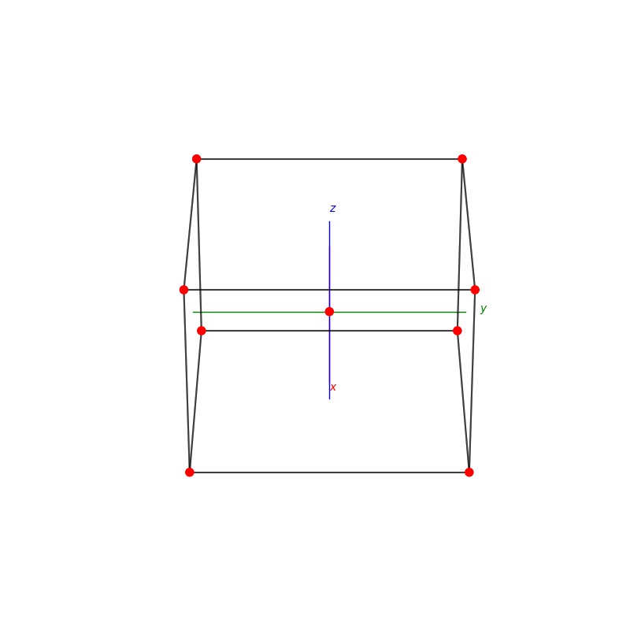
  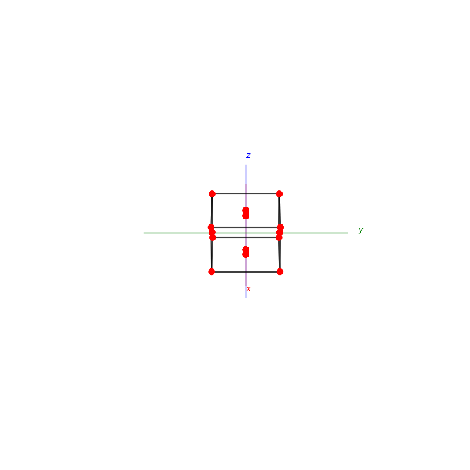
  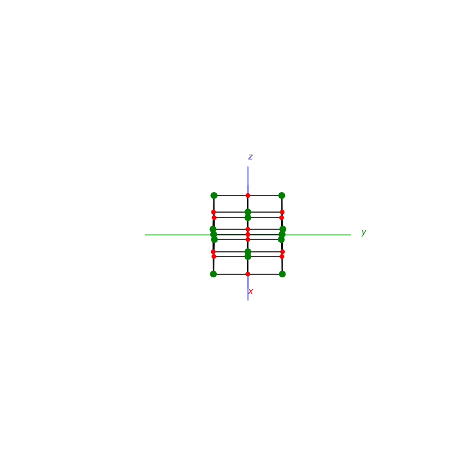
</p>


## Inversion Reflection Rotation
<p float="left">
  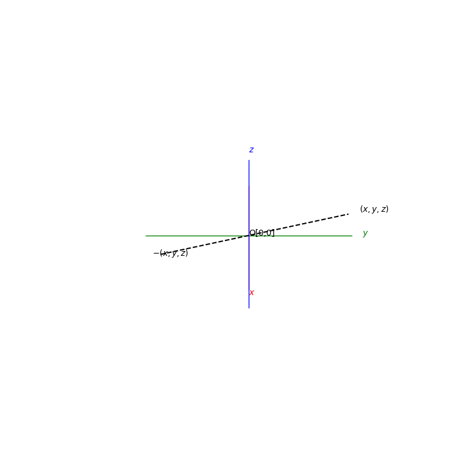
  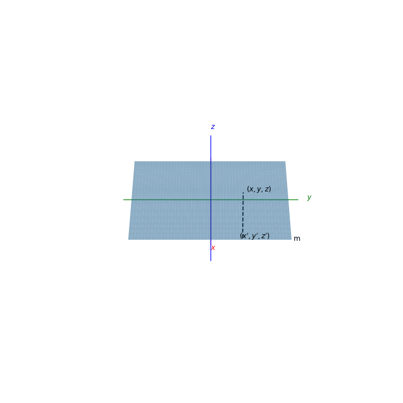
  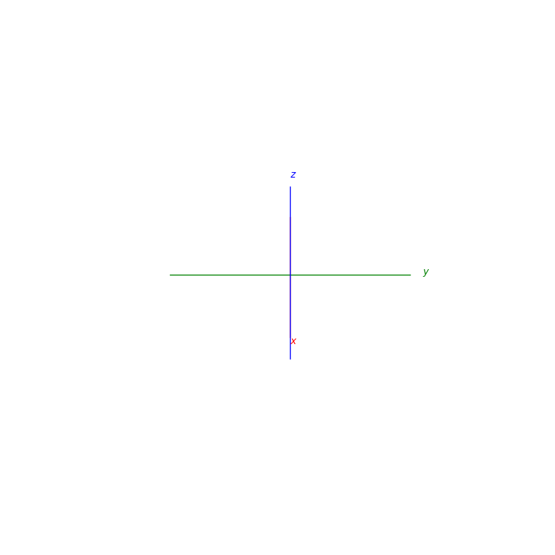
</p>


## Reflective Planes
<p float="left">
  
</p>


## Shapes
```py
import matplotlib.pyplot as plt
from mpl_toolkits.mplot3d import Axes3D
from PyShapes import *
```
```py
fig = plt.figure()
ax = fig.add_subplot(111,projection='3d')
plot_axis(ax)
cuboid(ax,5,5,5)

plt.show()
```
### Cuboids
<p float="left">
  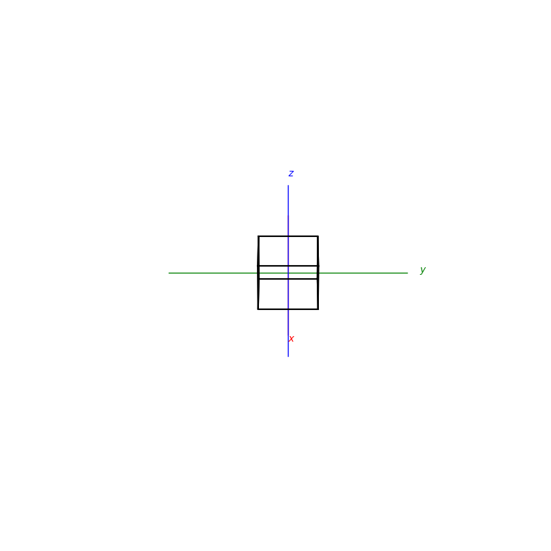
  
  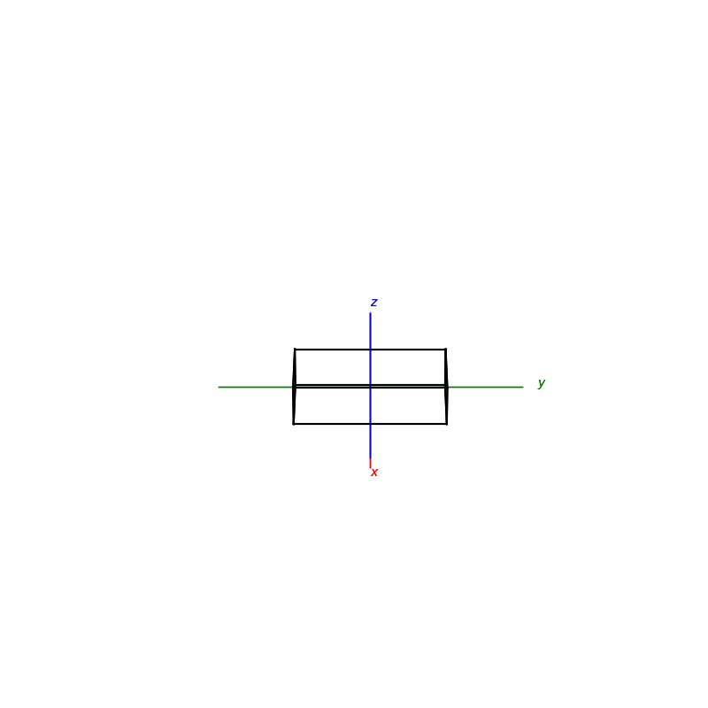
  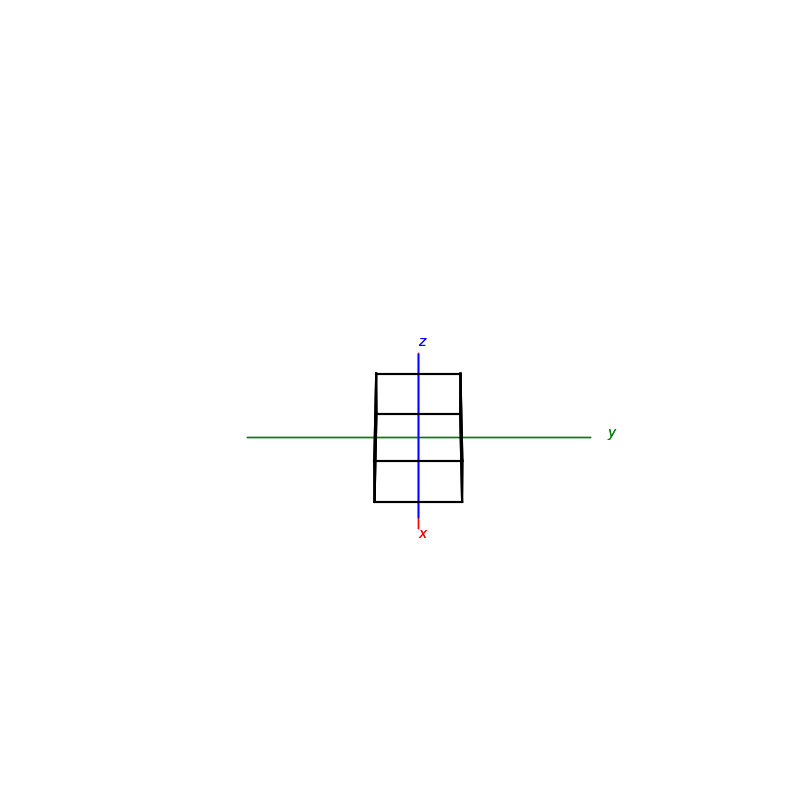
</p>

### Pyramids
<p float="left">
  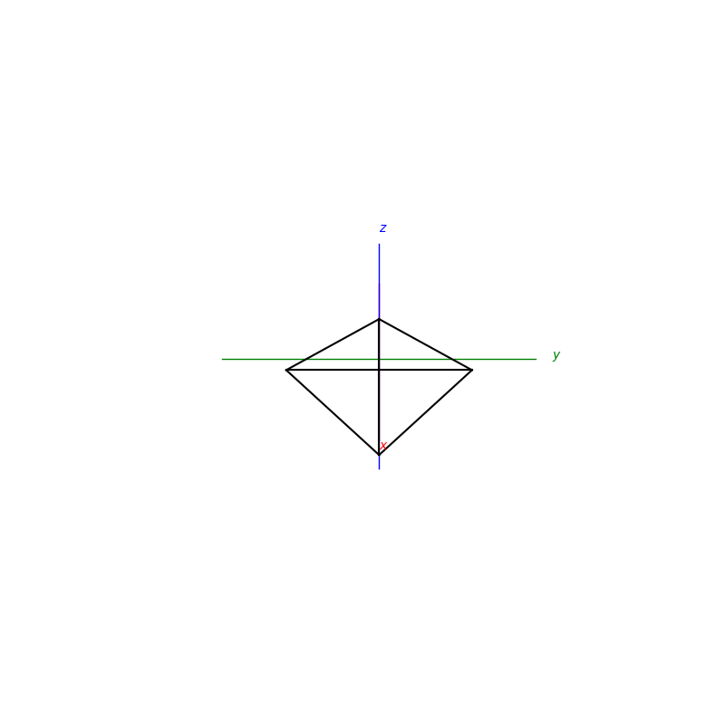
  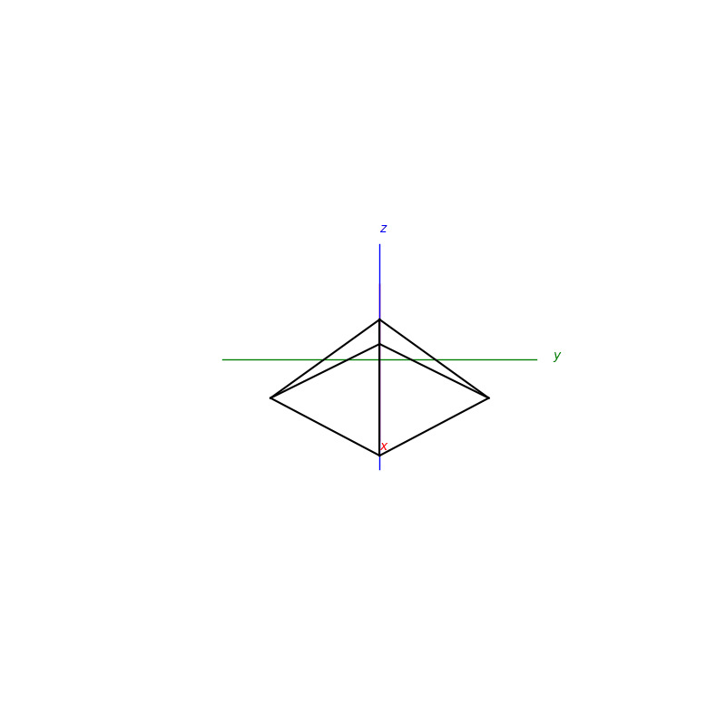
  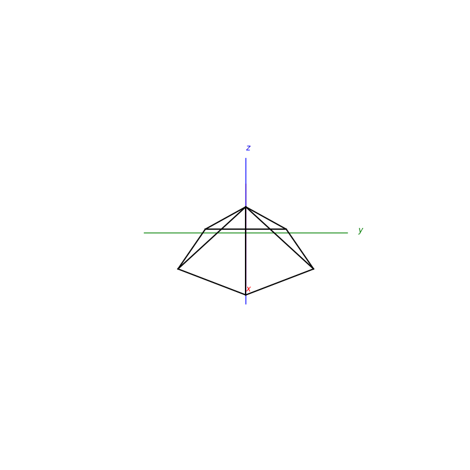
  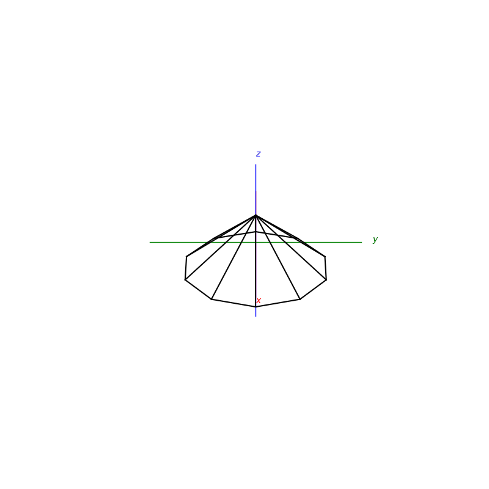
</p>

### Spintops
<p float="left">
  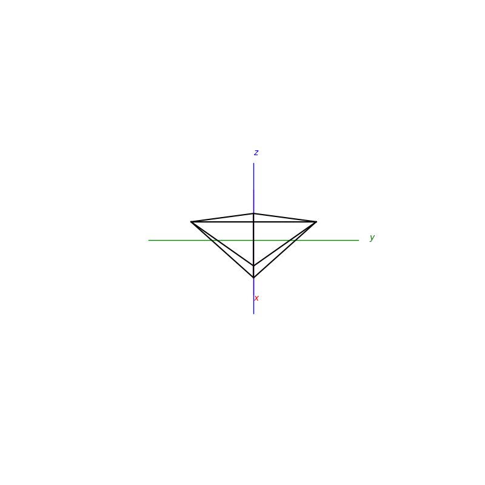
  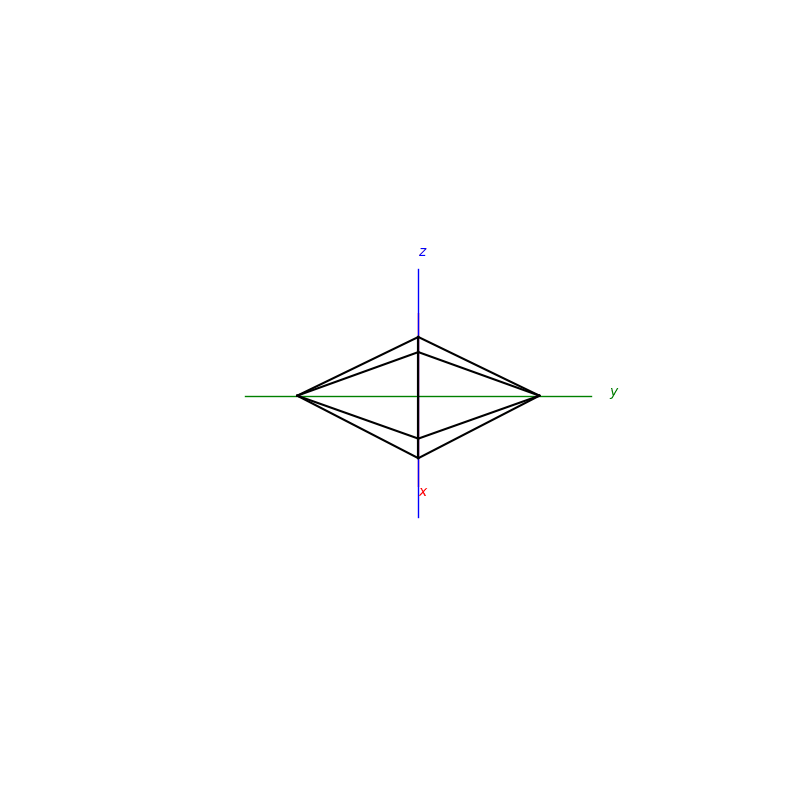
  
  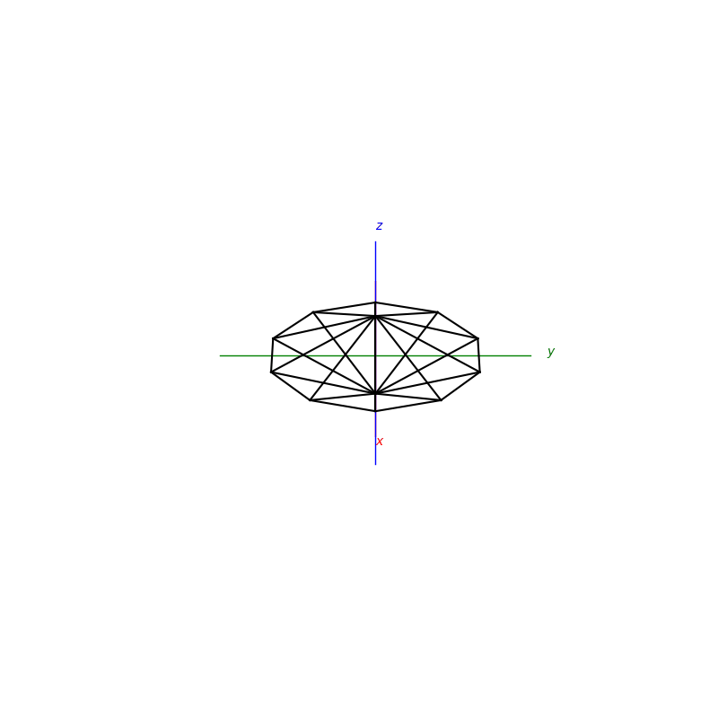
</p>
