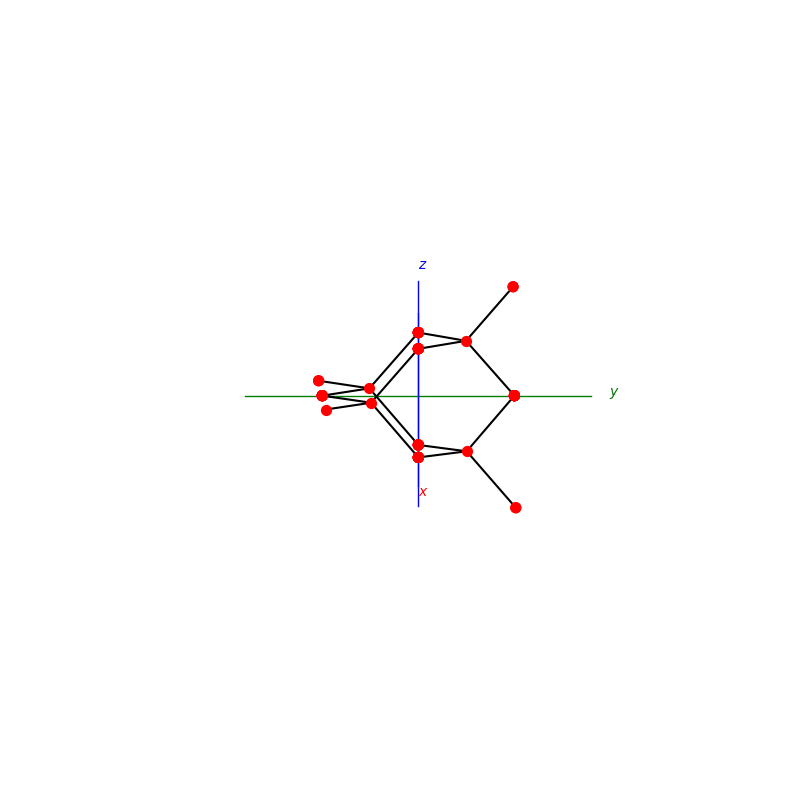
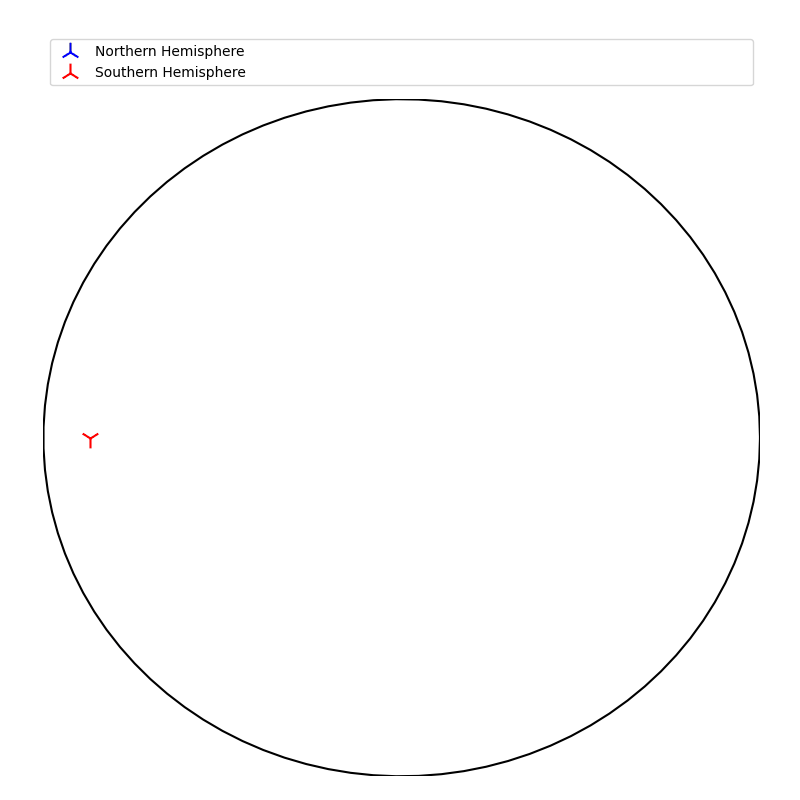
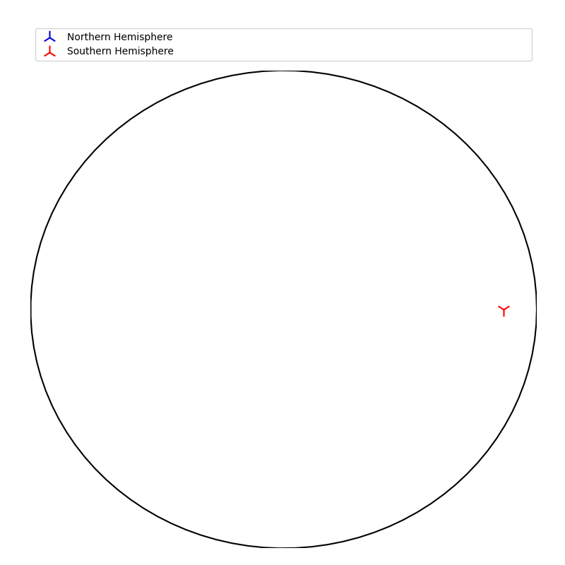
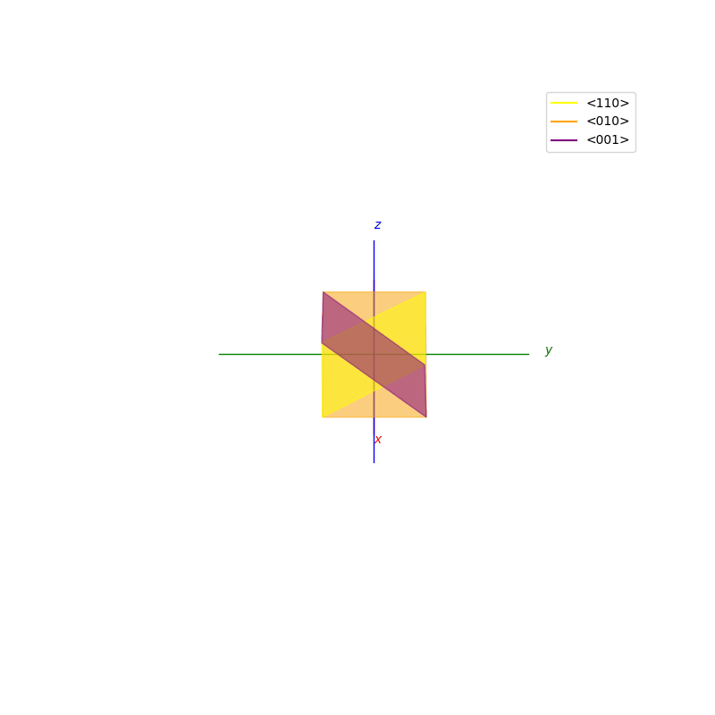
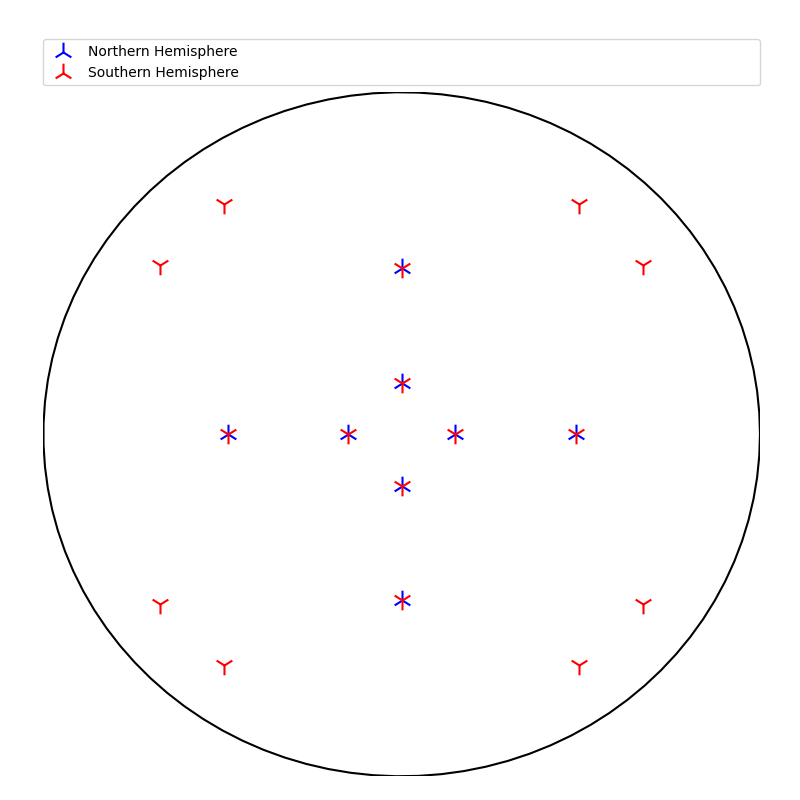
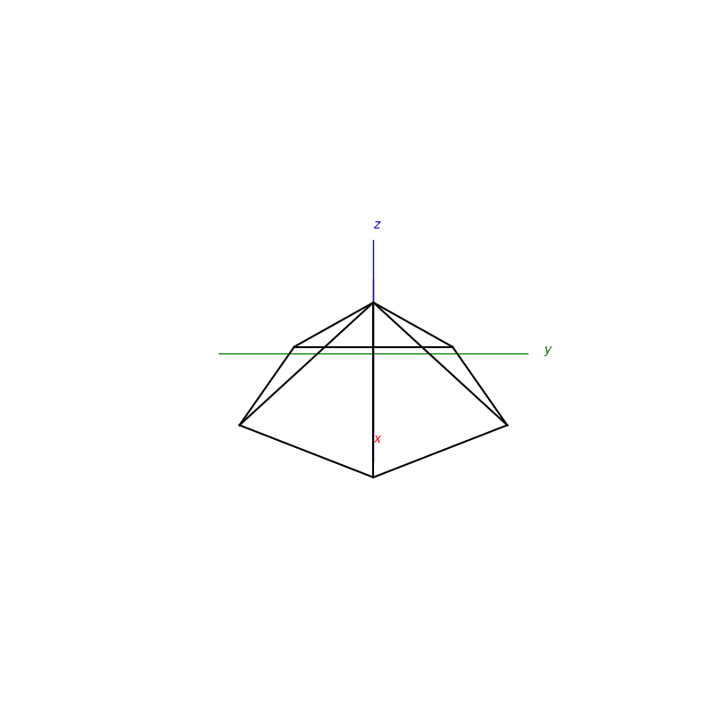
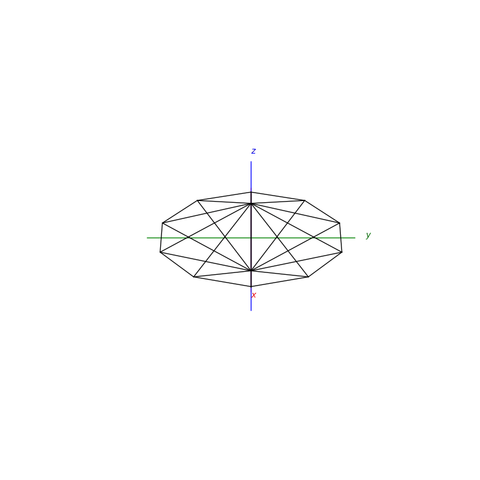
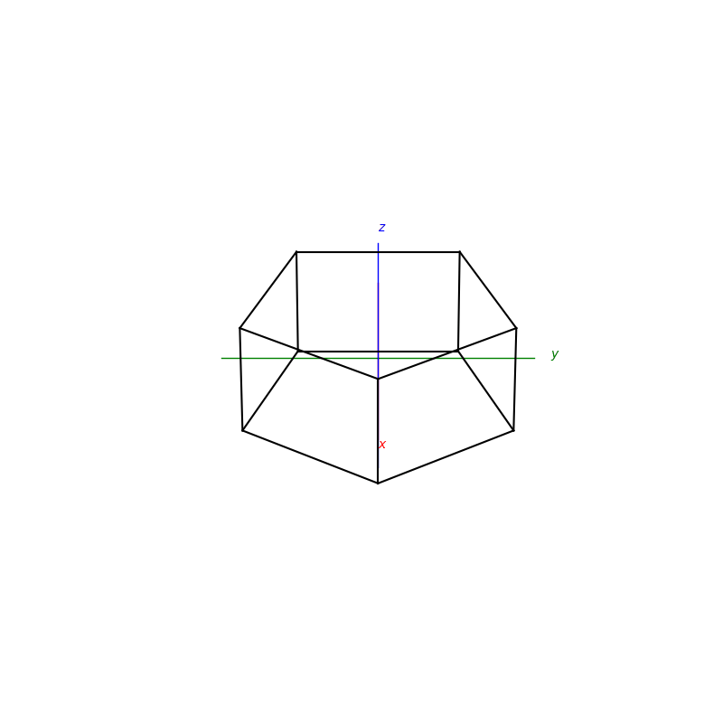
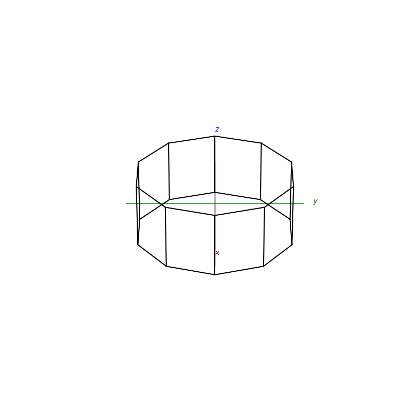
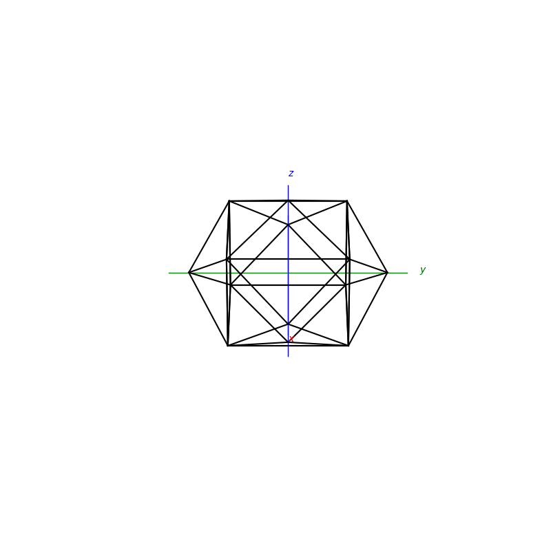

# PyCrystallography

## Atomic Structures
```py
def BCC(ax):
```
```py
def FCC(ax):
```
<p float="left">
  
  
</p>

```py
def NaCl(ax):
```
```py
def Diamond(ax):
```
<p float="left">
  
  
</p>


## Inversion - Reflection - Rotation
```py
def inversion(ax,h,w,d):
```
```py
def reflection(ax,h,w,d):
```
<p float="left">
  
  
</p>

<p float="left">
  
  
</p>


### Reflective Planes
```py

def cube_reflection(ax):
```
```py

def cube_reflection_diag(ax):
```
<p float="left">
  
  
</p>

## Face normal detection and Stereographic Projections
More info at [Stereographic Projection](https://github.com/Shellywell123/PyCrystallography/blob/main/docs/stereographic_projections.md)

<p float="left">
  
  
</p>


## Shapes
More info at [Stereographic Projection](https://github.com/Shellywell123/PyCrystallography/blob/main/docs/shapes.md)

<p float="left">
  
  
  
  
  
  
  
  
</p>