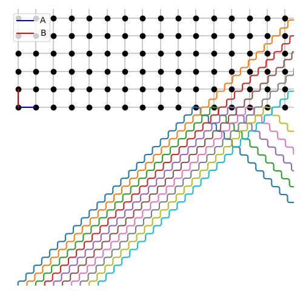
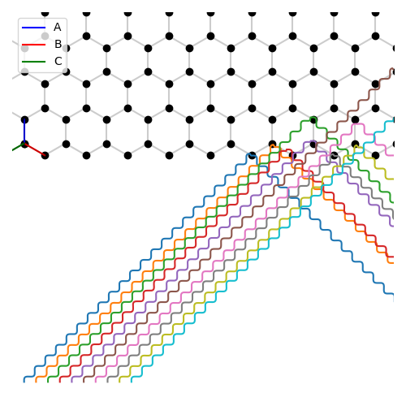

<p float="middle">
  
  
</p>

Python 3 package being written to illustrate crystallography.\
For more information and documentation see [shellywell123.github.io/PyCrystallography/](https://shellywell123.github.io/PyCrystallography/index.html)
### [List of package features - PyCrystallography Contents](https://github.com/Shellywell123/PyCrystallography/blob/main/docs/contents.md)


## Installation
```bash
pip3 install PyCrystallography
```

or

```bash
git clone https://github.com/Shellywell123/PyCrystallography/
```


## Some Examples
### [Penrose Tiling](https://shellywell123.github.io/PyCrystallography/docs/atomic_structure.md)

<p float="left">
  
  
</p>


### [Atomic Structures](https://shellywell123.github.io/PyCrystallography/docs/atomic_structure.md)

<p float="left">
  
  
</p>


### [Operations](https://shellywell123.github.io/PyCrystallography/docs/operations.md)

<p float="left">
  
  
</p>


### [Miller Indices](https://shellywell123.github.io/PyCrystallography/docs/atomic_structure.md)

<p float="left">
  
  
</p>

### [Geometry](https://shellywell123.github.io/PyCrystallography/docs/geometry.md)

<p float="left">
  
  
</p>

### [Face normal detection and Stereographic Projections](https://shellywell123.github.io/PyCrystallography/docs/stereographic_projections.md)

<p float="left">
  
  
</p>

### [Moire Patterns](https://shellywell123.github.io/PyCrystallography/docs/moire_patterns.md)

<p float="middle">
  
  
</p>

### [Xray-Diffraction](https://shellywell123.github.io/PyCrystallography/docs/xray_diffraction.md)
<p float="middle">
  
  
</p>

