# PyCrystallography

Python 3 package being written to illustrate crystallography.\
\
The features of the package include:
- [Atomic Structures](https://github.com/Shellywell123/PyCrystallography/blob/main/docs/atomic_structure.md)\
(Miller Indices, Lattices, primitive unit cells, Triangle Subdivision, Penrose Tiling)
- [3D Crystal Models](https://github.com/Shellywell123/PyCrystallography/blob/main/docs/geometry.md)\
(Cuboids,Pyramids,Bipyramids,Prisms,Biprismid,Tetrakis)
- [Stereographic Projections](https://github.com/Shellywell123/PyCrystallography/blob/main/docs/stereographic_projections.md)\
(Face normal detection of a 3D model, projected normals converted to stereographic projections)
- [Operations](https://github.com/Shellywell123/PyCrystallography/blob/main/docs/operations.md)\
(Inversion, Reflection, Rotation)
- [Moire Patterns](https://github.com/Shellywell123/PyCrystallography/blob/main/docs/moire_patterns.md)
- [Xray-Diffraction](https://github.com/Shellywell123/PyCrystallography/blob/main/docs/xray_diffraction.md)

## Installation
```bash
pip3 install PyCrystallography
```

or

```bash
git clone https://github.com/Shellywell123/PyCrystallography/
```


## Some Examples
### [Penrose Tiling](https://github.com/Shellywell123/PyCrystallography/blob/main/docs/atomic_structure.md)

<p float="left">
  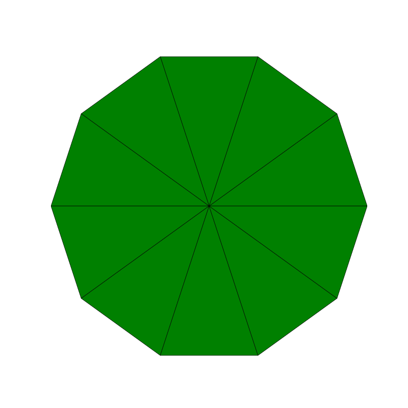
  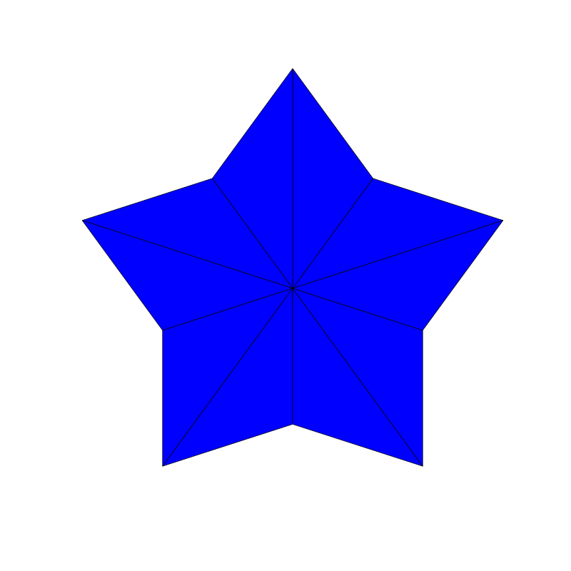
</p>


### [Atomic Structures](https://github.com/Shellywell123/PyCrystallography/blob/main/docs/atomic_structure.md)

<p float="left">
  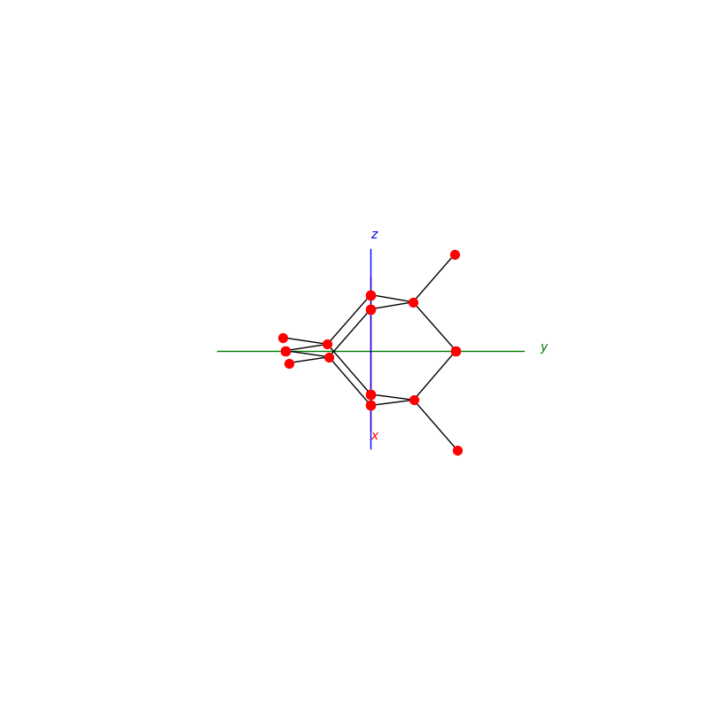
  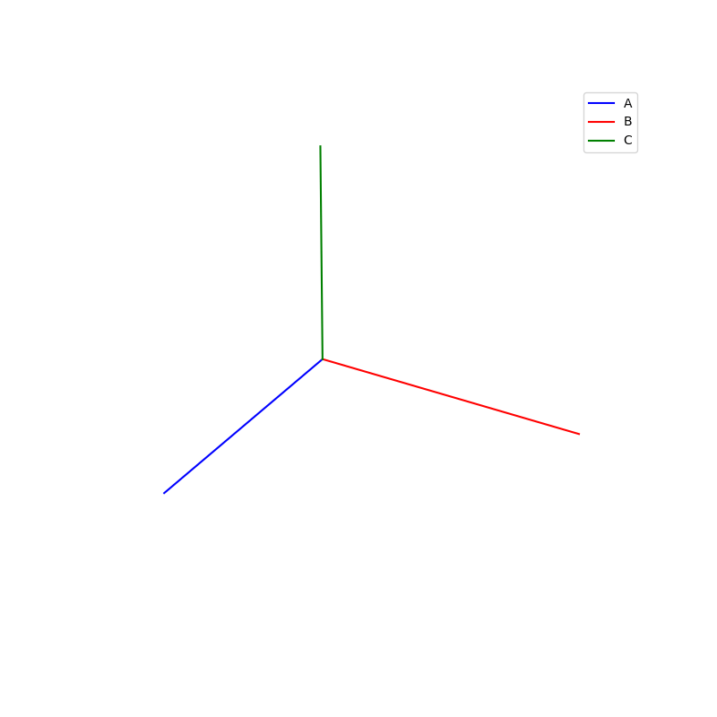
</p>


### [Operations](https://github.com/Shellywell123/PyCrystallography/blob/main/docs/operations.md)

<p float="left">
  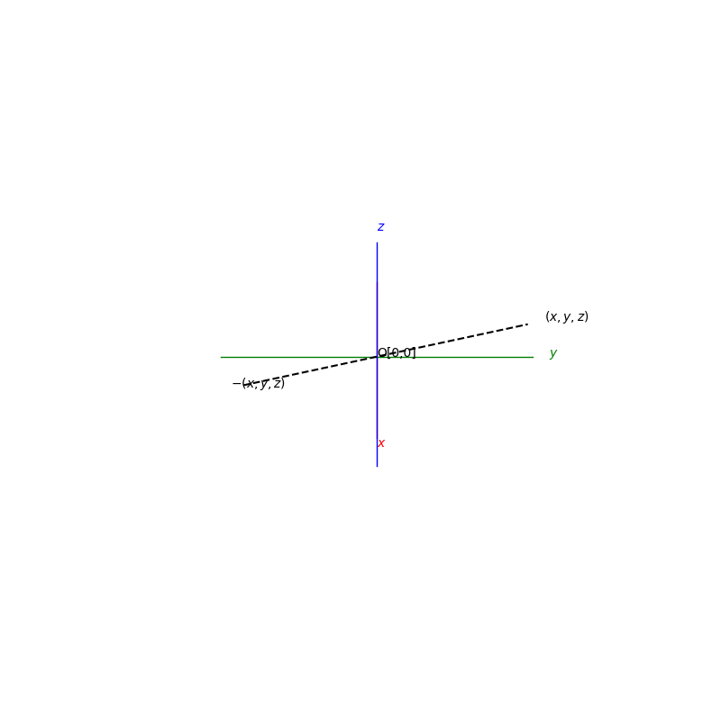
  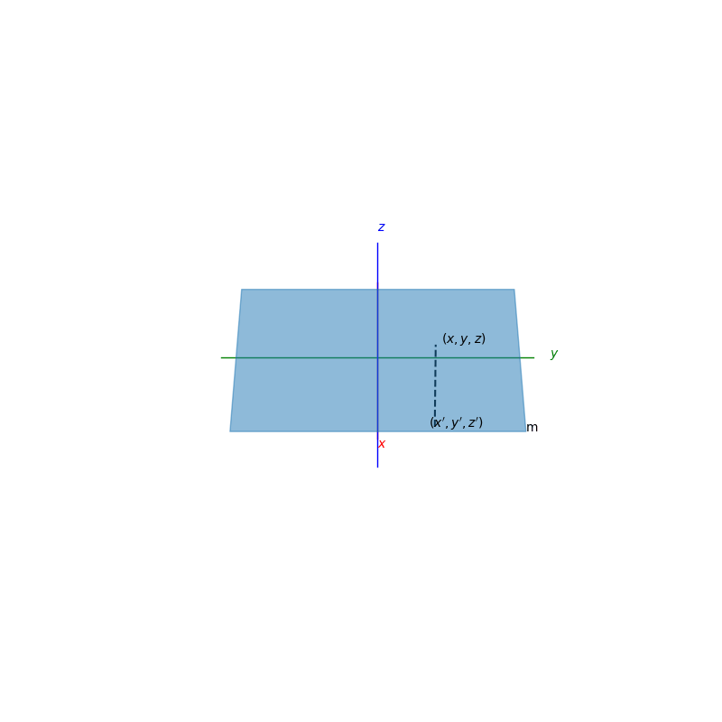
</p>


### [Miller Indices](https://github.com/Shellywell123/PyCrystallography/blob/main/docs/atomic_structure.md)

<p float="left">
  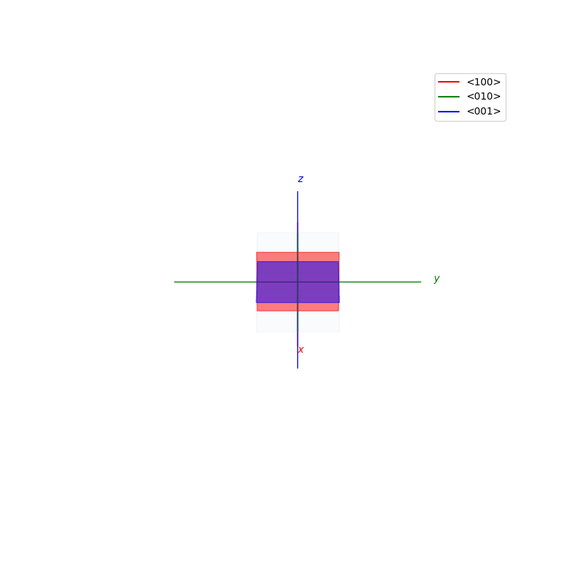
  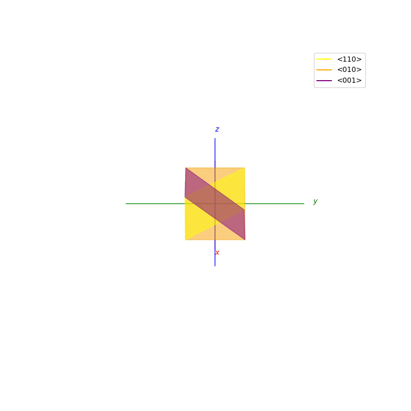
</p>

### [Geometry](https://github.com/Shellywell123/PyCrystallography/blob/main/docs/geometry.md)

<p float="left">
  
  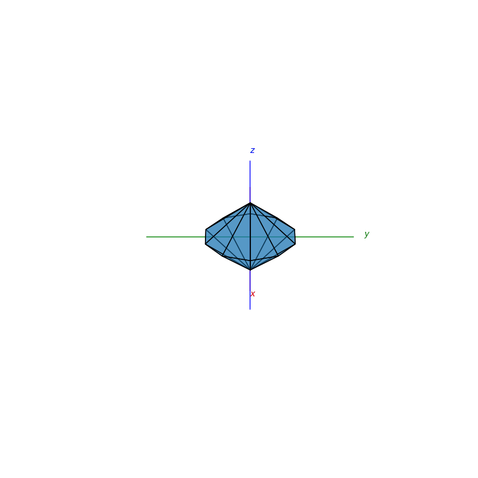
</p>

### [Face normal detection and Stereographic Projections](https://github.com/Shellywell123/PyCrystallography/blob/main/docs/stereographic_projections.md)

<p float="left">
  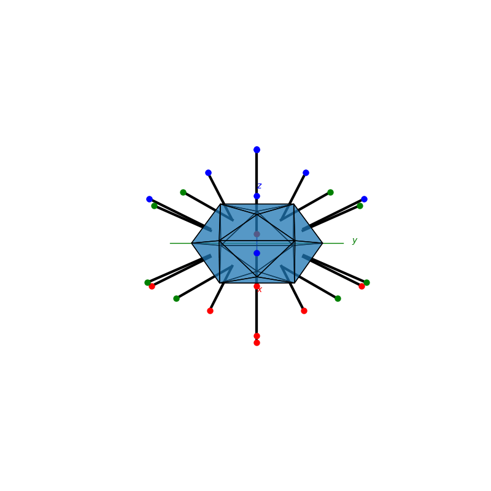
  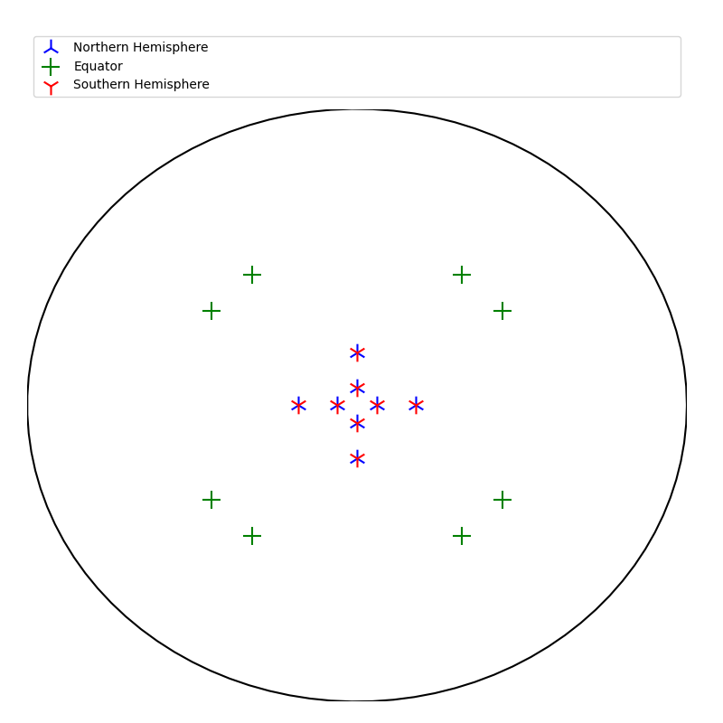
</p>

### [Moire Patterns](https://github.com/Shellywell123/PyCrystallography/blob/main/docs/moire_patterns.md)

<p float="middle">
  
  
</p>

### [Xray-Diffraction](https://github.com/Shellywell123/PyCrystallography/blob/main/docs/xray_diffraction.md)
<p float="middle">
  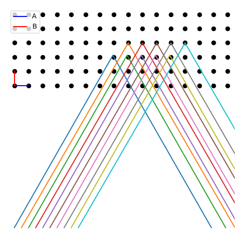
  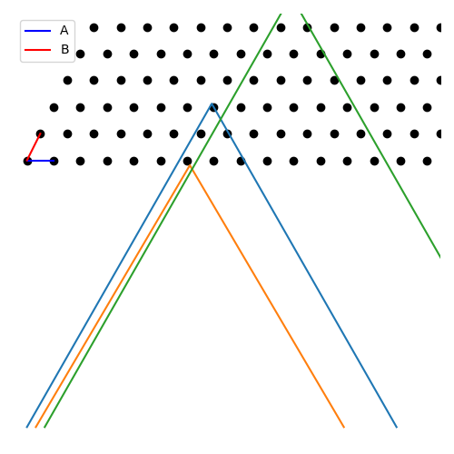
</p>

