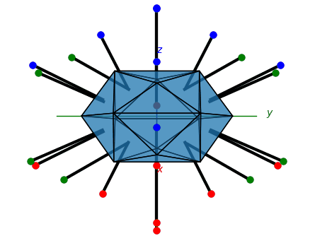

<p float="middle">
  
  
</p>

Python 3 package being written to illustrate crystallography.\
For more information and documentation see [PyCrystallography - website](https://shellywell123.github.io/PyCrystallography/index.html)

## Installation
```bash
pip3 install PyCrystallography
```

or

```bash
git clone https://github.com/Shellywell123/PyCrystallography/
```
