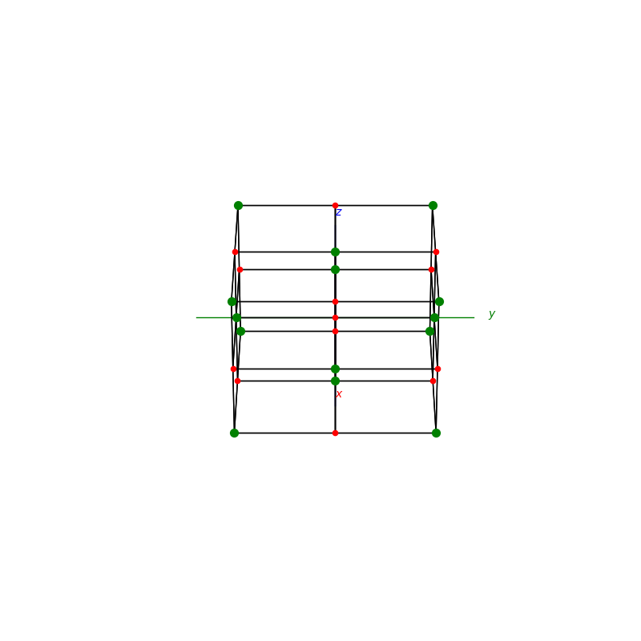

# PyCrystallography

## Atomic Structures
```py
def BCC(ax):
```
```py
def FCC(ax):
```
<p float="left">
  
  
</p>

```py
def NaCl(ax):
```
```py
def Diamond(ax):
```
<p float="left">
  
  
</p>


## Inversion & Reflection
```py
def inversion(ax,h,w,d):
```
```py
def reflection(ax,h,w,d):
```
<p float="left">
  
  
</p>


### Reflective Planes
```py

def cube_reflection(ax,h,w,d):
```
<p float="left">
  
</p>

## Face normal detection and Stereographic Projection
```py

fig = plt.figure(0,figsize=[8,8])
ax = fig.add_subplot(111,projection='3d')
h,w,d = 2,2,5
faces = cuboid(ax,2,2,2)
r = max(h,w,d)
points=normal_points(ax,faces,r)
Stereographic_projection(ax,points,r)
plt.show()
```
<p float="left">
  
  
</p>

## Shapes
```py
import matplotlib.pyplot as plt
from mpl_toolkits.mplot3d import Axes3D
from PyShapes import *
```
```py
fig = plt.figure()
ax = fig.add_subplot(111,projection='3d')
plot_axis(ax)
cuboid(ax,5,5,5)

plt.show()
```
### Cuboids
```py
def cuboid(ax,h,w,d):
```
<p float="left">
  
  
  
  
</p>

### Pyramids
```py
def pryamid(ax,h,num_of_side):
```
<p float="left">
  
  
  
  
</p>

### Bipyramids
```py
def bipryamid(ax,h,num_of_side):
```
<p float="left">
  
  
  
  
</p>

### Prisms
```py
def prism(ax,h,num_of_side):
```
<p float="left">
  
  
  
  
</p>

### Biprismid (not sure what its proper name is)
```py
def biprismid(ax,h,num_of_side):
```
<p float="left">
  
  
  
  
</p>

### Tetrakis
```py
def tetrakis(ax,h,dh):
```
<p float="left">
  
</p>