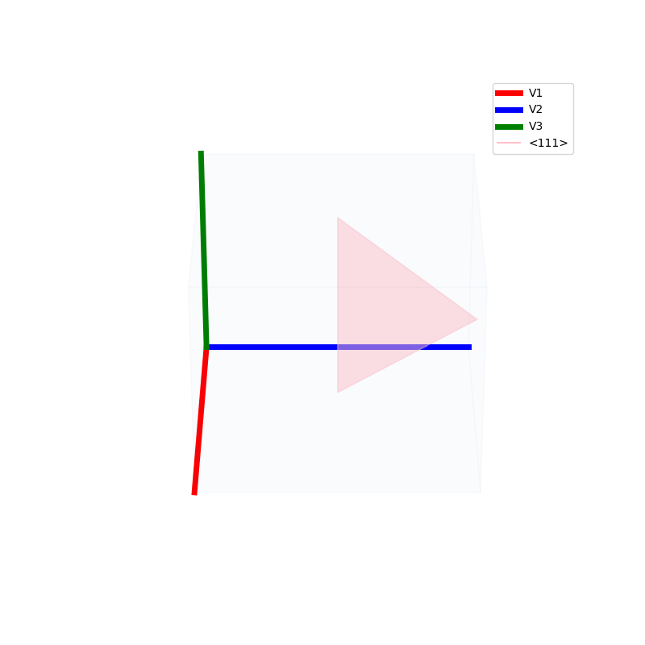
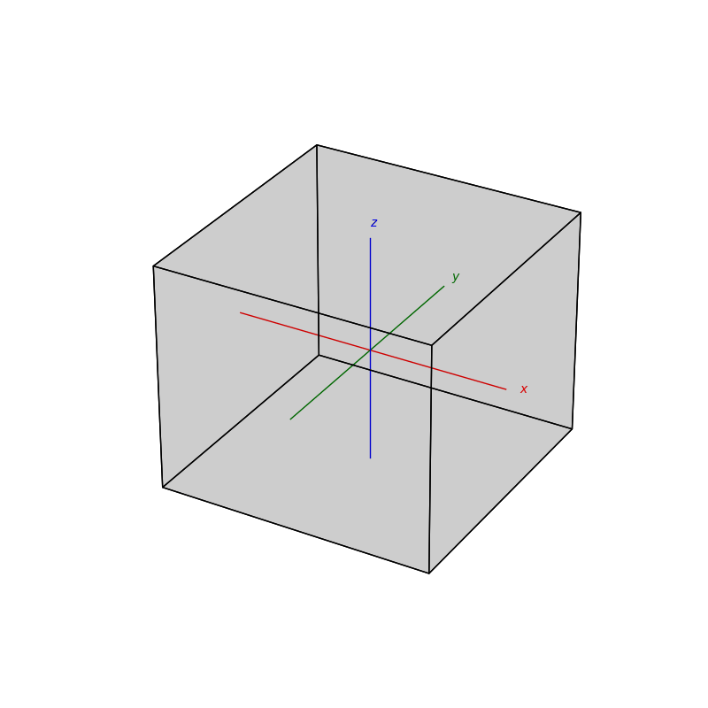

# Atomic Structures of crystals

<hr />

### Miller Indices
The miller indices are used to denote the planes in crystal lattices.

<p float="left">
  
  
  
  
  
  
  
</p>

<br />
<br />
<br />


<hr />

## Lattice - Types <a name="types"></a>
### Bravais

Lattices are used as a way to map the structure of crystals. A Bravais Lattice is on that is constructed from an infinite array of discrete points by a set of discrete translation operations (primitive vectors, `A`,`B`,`C` in the below figures.)
```py
from PyCrystallography import unit_cell
prim = unit_cell.primitive_cell_2d('square')
from PyCrystallography import lattice
lattice.make_lattice(prim)
plt.show()
```

```py
from PyCrystallography import unit_cell
prim = unit_cell.primitive_cell_2d('rhombus')
from PyCrystallography import lattice
lattice.make_lattice(prim)
plt.show()
```

possible unit cell shapes:
 - `triangle`
 - `square`
 - `rhombus`
 - `hexagon`

<p float="left">
  
  
  
  
</p>

### Reciprocal 
CODE:
```py
from PyCrystallography import unit_cell
from PyCrystallography import lattice

import matplotlib .pyplot as plt
from mpl_toolkits.mplot3d import Axes3D

#set lattice depths
d = 3

#set primitive vectors
A = [1,0,0]
B = [0,1,0]
C = [0,0,10]

vectors = [A,B,C]

fig = plt.figure('Latiices',figsize=[8,4])
ax1 = fig.add_subplot(121,projection='3d')
ax1.set_title('Bravais')
prim = unit_cell.custom_unit_cell(ax1,vectors)
lattice.make_lattice_3d(ax1,prim,depth=d)

vectors_r = lattice.make_vectors_reciprocal(vectors)

ax2 = fig.add_subplot(122,projection='3d')
ax2.set_title('Reciprocal')
prim = unit_cell.custom_unit_cell(ax2,vectors_r)
lattice.make_lattice_3d(ax2,prim,depth=d,tag='_r')

plt.show()
```
OUTPUT:
```bash
Primitive Vectors
   A =  [1, 0, 0]
   B =  [0, 1, 0]
   C =  [0, 0, 10]

Unit Cell Volume = 10

Reciporocal Primitive Vectors
   A_r =  [6.28318531 0.         0.        ]
   B_r =  [0.         6.28318531 0.        ]
   C_r =  [0.         0.         0.62831853]

Reciprocal Unit Cell Volume = 24.805021344239854
```

<p float="left">
  
</p>

<br />
<br />
<br />

## Lattice  - Construction <a name="construction"></a>

A lattice is made up of cells, the most important being primitive unit cells.

```py
fig = plt.figure(0,figsize=[8,8])
ax = fig.add_subplot(111,projection='3d')
from PyCrystallography import unit_cell
prim = unit_cell.BCC(ax)

fig = plt.figure(1,figsize=[8,8])
ax = fig.add_subplot(111,projection='3d')
from PyCrystallography import lattice
lattice.make_lattice_3d(ax,prim)
plt.show()
```
<p float="left">
  
  
</p>

```py
fig = plt.figure(0,figsize=[8,8])
ax = fig.add_subplot(111,projection='3d')
from PyCrystallography import unit_cell
prim = unit_cell.FCC(ax)

fig = plt.figure(1,figsize=[8,8])
ax = fig.add_subplot(111,projection='3d')
from PyCrystallography import lattice
lattice.make_lattice_3d(ax,prim)
plt.show()
```

<p float="left">
  
  
</p>

```py
fig = plt.figure(0,figsize=[8,8])
ax = fig.add_subplot(111,projection='3d')
from PyCrystallography import unit_cell
prim = unit_cell.NaCl(ax)

fig = plt.figure(1,figsize=[8,8])
ax = fig.add_subplot(111,projection='3d')
from PyCrystallography import lattice
lattice.make_lattice_3d(ax,prim)
plt.show()
```

<p float="left">
  
  
</p>


```py
fig = plt.figure(0,figsize=[8,8])
ax = fig.add_subplot(111,projection='3d')
from PyCrystallography import unit_cell
prim = unit_cell.Diamond(ax)

fig = plt.figure(1,figsize=[8,8])
ax = fig.add_subplot(111,projection='3d')
from PyCrystallography import lattice
lattice.make_lattice_3d(ax,prim)
plt.show()

```
<p float="left">
  
  
</p>

# Packings

## Penrose Tiling

```py
Penrose_Tiling(n,'sun')
```

```py
Penrose_Tiling(n,'star')
```

<p float="left">
  
  
</p>

## subdivision

```py
triangle_subdivision(n,'diag')
```

```py
triangle_subdivision(n,'grid')
```

<p float="left">
  
  
</p>

```py
triangle_subdivision(n,'serpinski')
```

```py
serpinksi_carpet(n)
```

<p float="left">
  
  
</p>

## 3D Fractal Packing


```py
menger_cube(n)
```

<p float="left">
  
</p>