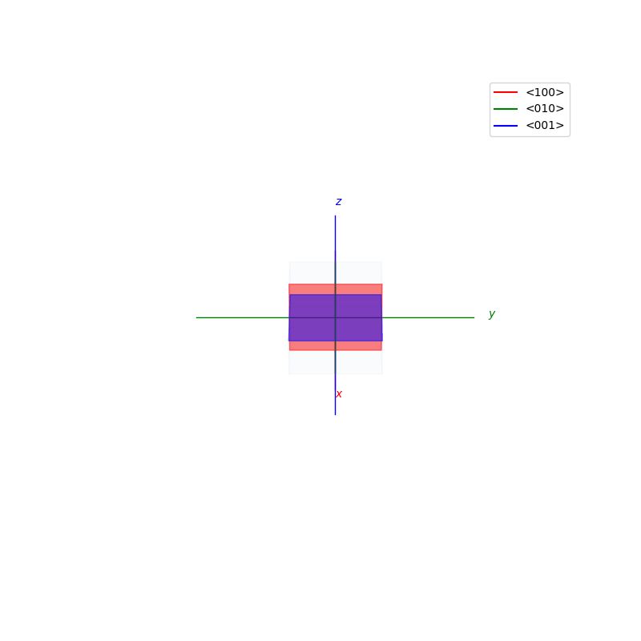
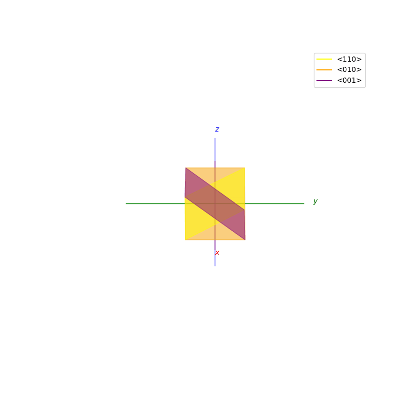
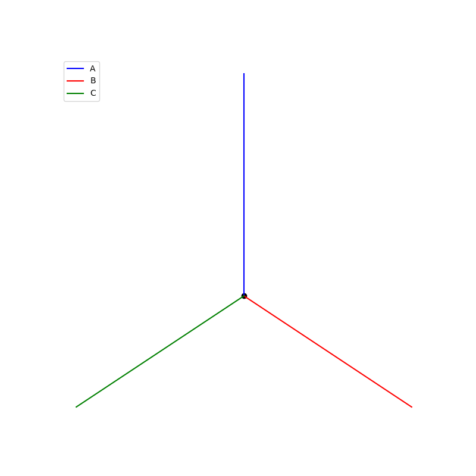
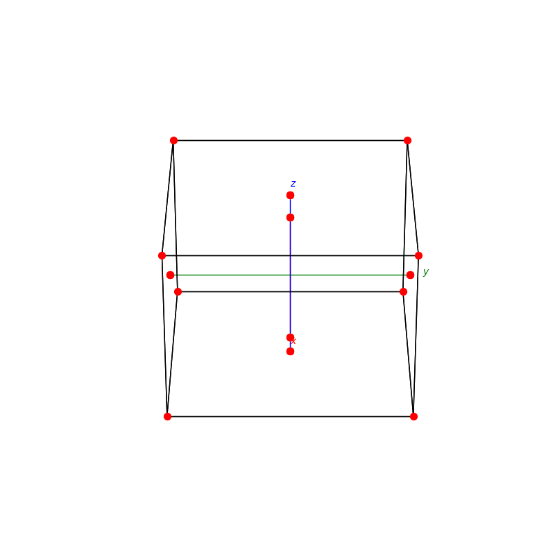
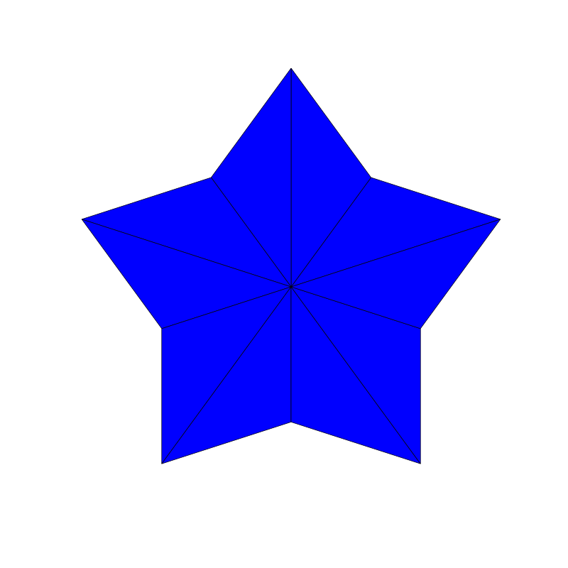

# Atomic Structures of crystals

### Page Contents
TODO

## Miller Indices

The miller indices are used to denote the planes in crystal lattices.

<p float="left">
  
  
  
  
  
  
  
</p>

<br />
<br />
<br />

## Planes of reflections in a Cube
```py

def cube_reflection(ax):
```
```py

def cube_reflection_diag(ax):
```
<p float="left">
  
  
</p>

<br />
<br />
<br />

## Lattice - Types
### Bravais

Lattices are used as a way to map the structure of crystals. A Bravais Lattice is on that is constructed from an infinite array of discrete points by a set of discrete translation operations (primitive vectors, `A`,`B`,`C` in the below figures.)
```py
from PyCrystallography import unit_cell
prim = unit_cell.primitive_cell_2d('square')
from PyCrystallography import lattice
lattice.make_lattice(prim)
plt.show()
```

```py
from PyCrystallography import unit_cell
prim = unit_cell.primitive_cell_2d('rhombus')
from PyCrystallography import lattice
lattice.make_lattice(prim)
plt.show()
```

possible unit cell shapes:
 - `triangle`
 - `square`
 - `rhombus`
 - `hexagon`

<p float="left">
  
  
  
  
</p>

### Reciprocal 
TODO
<br />
<br />
<br />

## Lattice  - Construction

A lattice is made up of cells, the most important being primitive unit cells.

```py
fig = plt.figure(0,figsize=[8,8])
ax = fig.add_subplot(111,projection='3d')
from PyCrystallography import unit_cell
prim = unit_cell.BCC(ax)

fig = plt.figure(1,figsize=[8,8])
ax = fig.add_subplot(111,projection='3d')
from PyCrystallography import lattice
lattice.make_lattice_3d(ax,prim)
plt.show()
```
<p float="left">
  
  
</p>

```py
fig = plt.figure(0,figsize=[8,8])
ax = fig.add_subplot(111,projection='3d')
from PyCrystallography import unit_cell
prim = unit_cell.FCC(ax)

fig = plt.figure(1,figsize=[8,8])
ax = fig.add_subplot(111,projection='3d')
from PyCrystallography import lattice
lattice.make_lattice_3d(ax,prim)
plt.show()
```

<p float="left">
  
  
</p>

```py
fig = plt.figure(0,figsize=[8,8])
ax = fig.add_subplot(111,projection='3d')
from PyCrystallography import unit_cell
prim = unit_cell.NaCl(ax)

fig = plt.figure(1,figsize=[8,8])
ax = fig.add_subplot(111,projection='3d')
from PyCrystallography import lattice
lattice.make_lattice_3d(ax,prim)
plt.show()
```

<p float="left">
  
  
</p>


```py
fig = plt.figure(0,figsize=[8,8])
ax = fig.add_subplot(111,projection='3d')
from PyCrystallography import unit_cell
prim = unit_cell.Diamond(ax)

fig = plt.figure(1,figsize=[8,8])
ax = fig.add_subplot(111,projection='3d')
from PyCrystallography import lattice
lattice.make_lattice_3d(ax,prim)
plt.show()

```
<p float="left">
  
  
</p>

# Packings

## subdivision

```py
triangle_subdivision(n,'diag')
```

```py
triangle_subdivision(n,'grid')
```

<p float="left">
  
  
</p>

```py
triangle_subdivision(n,'zelda')
```

<p float="left">
  
</p>

## Penrose Tiling

```py
Penrose_Tiling(n,'sun')
```

```py
Penrose_Tiling(n,'star')
```

<p float="left">
  
  
</p>

