# Atomic Structures of crystals

## Miller Indices

The miller indices are used to denote the planes in crstallography in a crystal lattice.

<p float="left">
  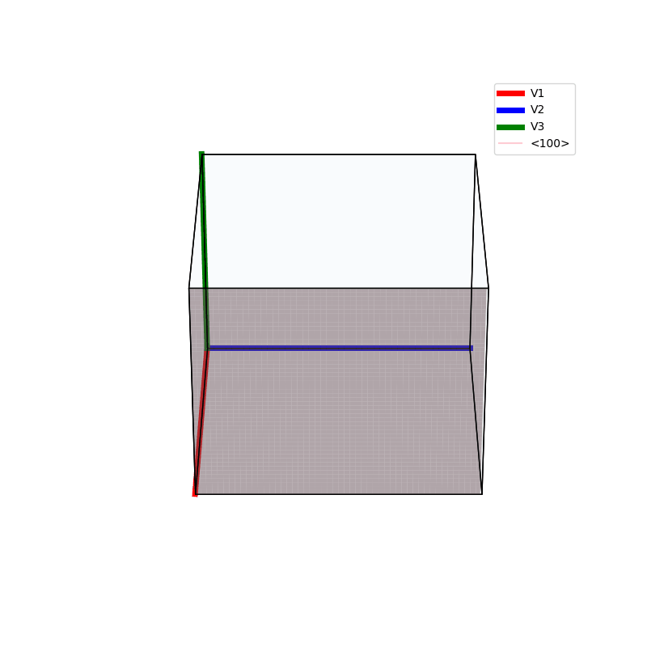
  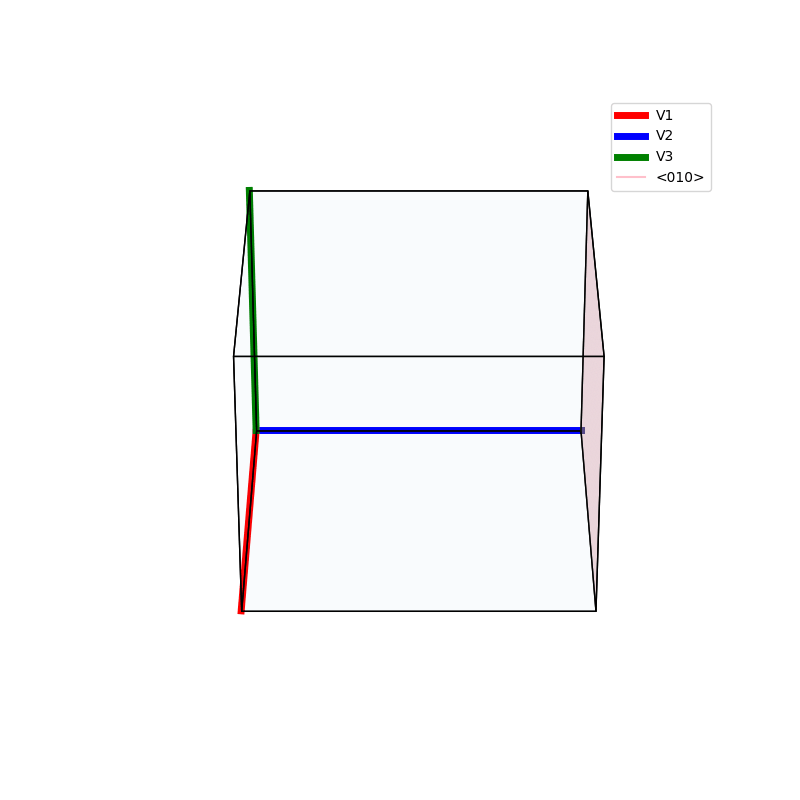
  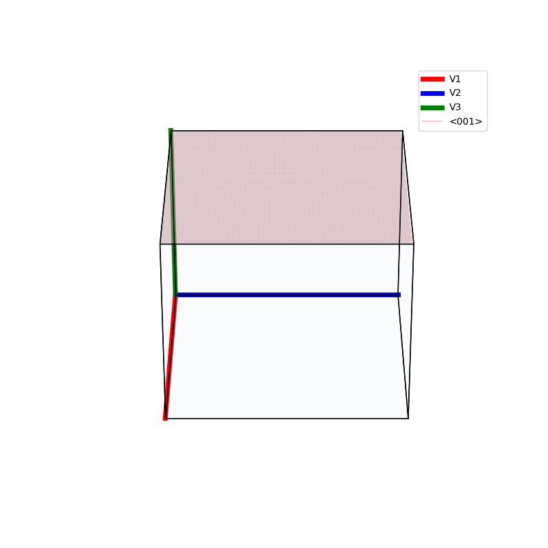
  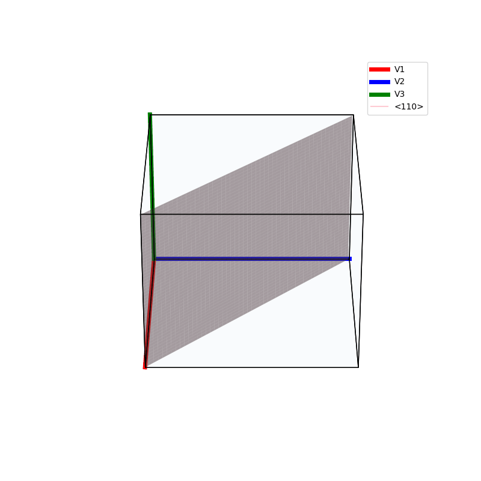
  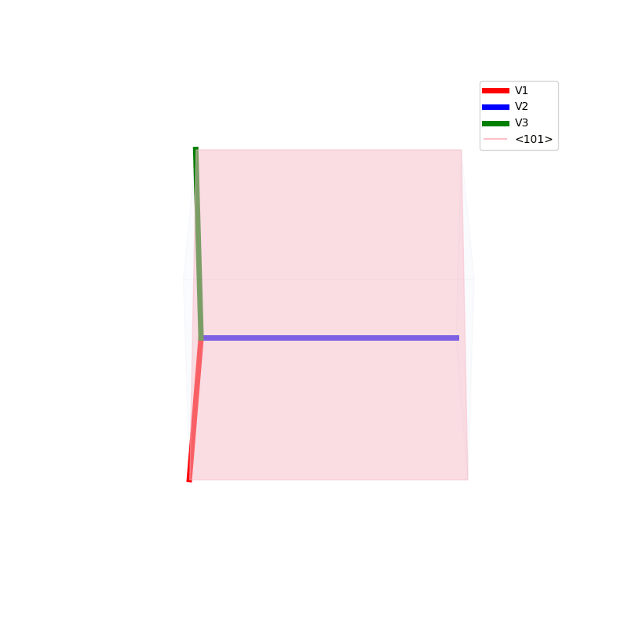
  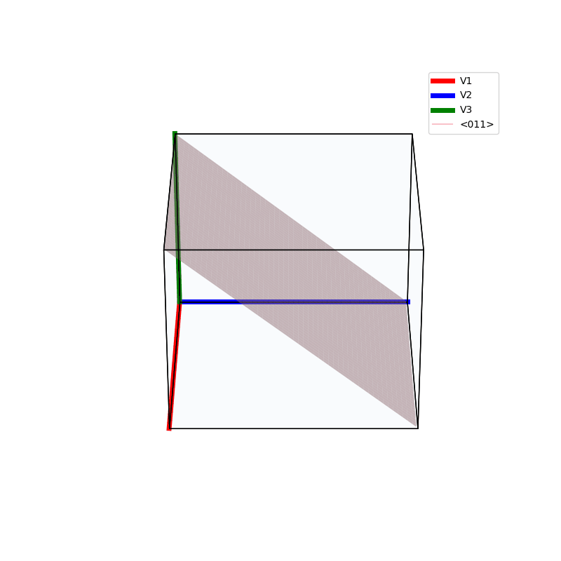
  
</p>


## Planes of reflections in a Cube
```py

def cube_reflection(ax):
```
```py

def cube_reflection_diag(ax):
```
<p float="left">
  
  
</p>

## Lattices

```py
prim = primitive_cell_2d('square')
make_lattice(prim)
plt.show()
```

```py
prim = primitive_cell_2d('rhombus')
make_lattice(prim)
plt.show()
```

<p float="left">
  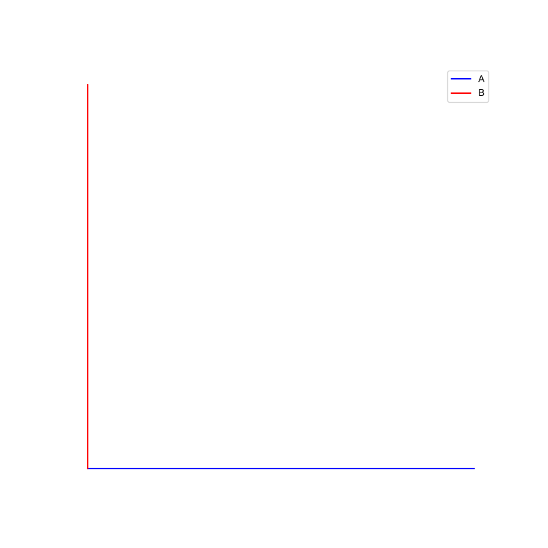
  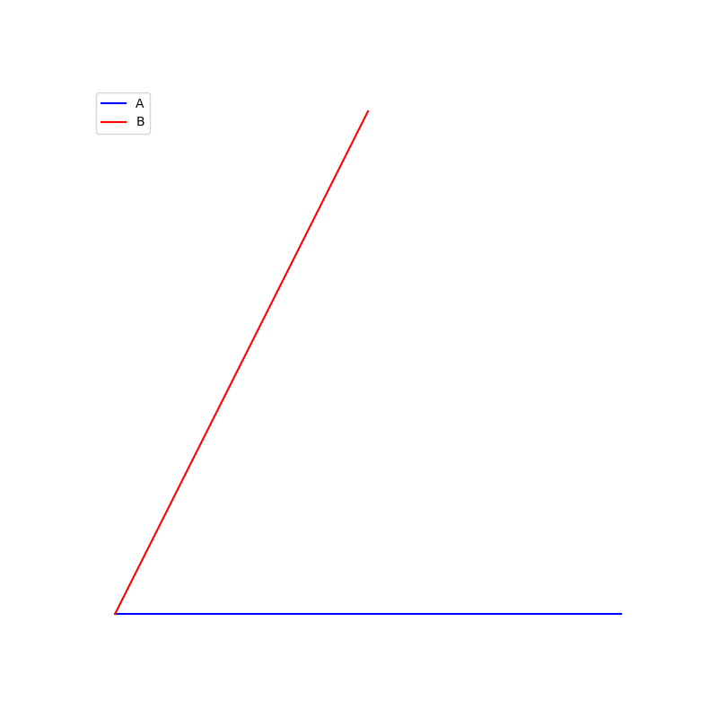
</p>

### unit cells

```py
fig = plt.figure(0,figsize=[8,8])
ax = fig.add_subplot(111,projection='3d',azim=30,elev=30)
prim = BCC(ax)

fig = plt.figure(1,figsize=[8,8])
ax = fig.add_subplot(111,projection='3d',azim=30,elev=30)
make_lattice_3d(ax,prim)
plt.show()
```
<p float="left">
  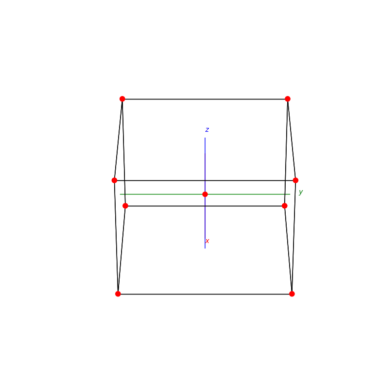
  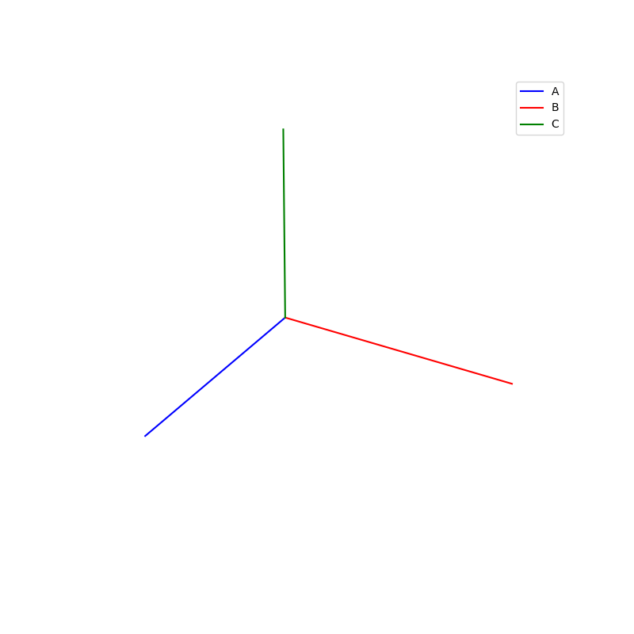
</p>

```py
fig = plt.figure(0,figsize=[8,8])
ax = fig.add_subplot(111,projection='3d',azim=30,elev=30)
prim = FCC(ax)

fig = plt.figure(1,figsize=[8,8])
ax = fig.add_subplot(111,projection='3d',azim=30,elev=30)
make_lattice_3d(ax,prim)
plt.show()
```

<p float="left">
  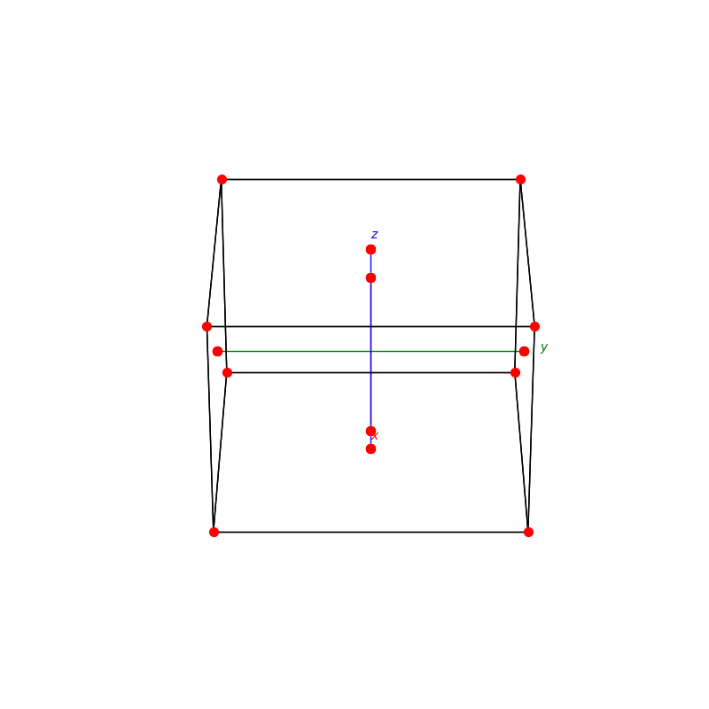
  
</p>

```py
fig = plt.figure(0,figsize=[8,8])
ax = fig.add_subplot(111,projection='3d',azim=30,elev=30)
prim = NaCl(ax)

fig = plt.figure(1,figsize=[8,8])
ax = fig.add_subplot(111,projection='3d',azim=30,elev=30)
make_lattice_3d(ax,prim)
plt.show()
```

<p float="left">
  
  
</p>


```py
fig = plt.figure(0,figsize=[8,8])
ax = fig.add_subplot(111,projection='3d',azim=30,elev=30)
prim = Diamond(ax)

fig = plt.figure(1,figsize=[8,8])
ax = fig.add_subplot(111,projection='3d',azim=30,elev=30)
make_lattice_3d(ax,prim)
plt.show()

```
<p float="left">
  
  
</p>

# Packings

## subdivision

```py
triangle_subdivision(n,'diag')
```

```py
triangle_subdivision(n,'grid')
```

<p float="left">
  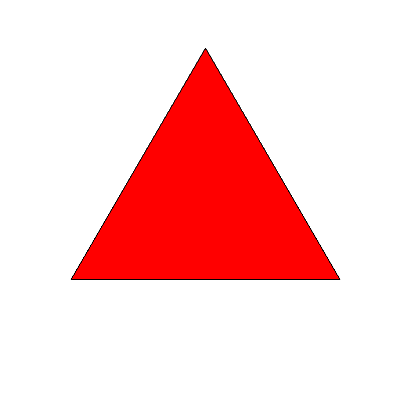
  
</p>

```py
triangle_subdivision(n,'zelda')
```

<p float="left">
  
</p>

## Penrose Tiling

```py
Penrose_Tiling(n,'sun')
```

```py
Penrose_Tiling(n,'star')
```

<p float="left">
  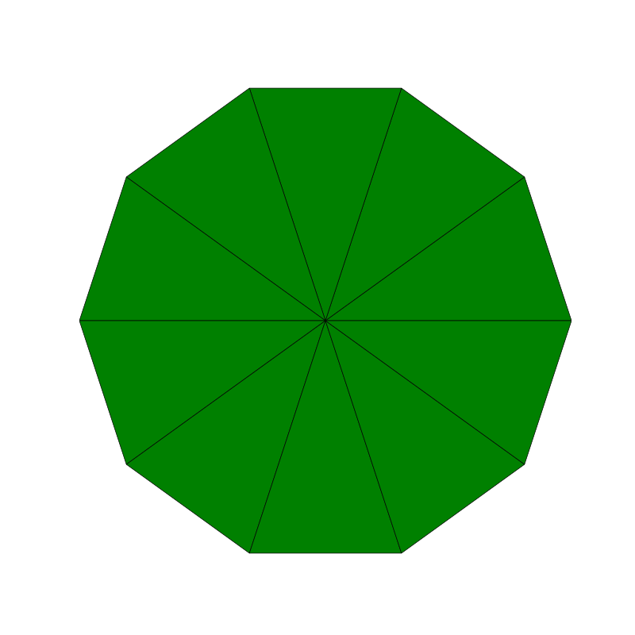
  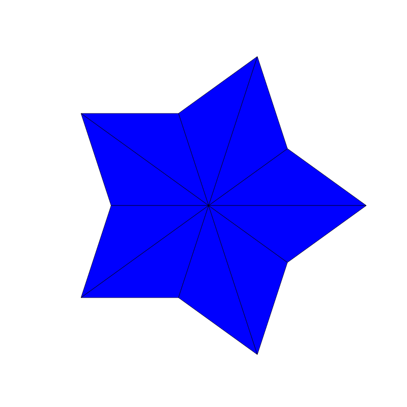
</p>

