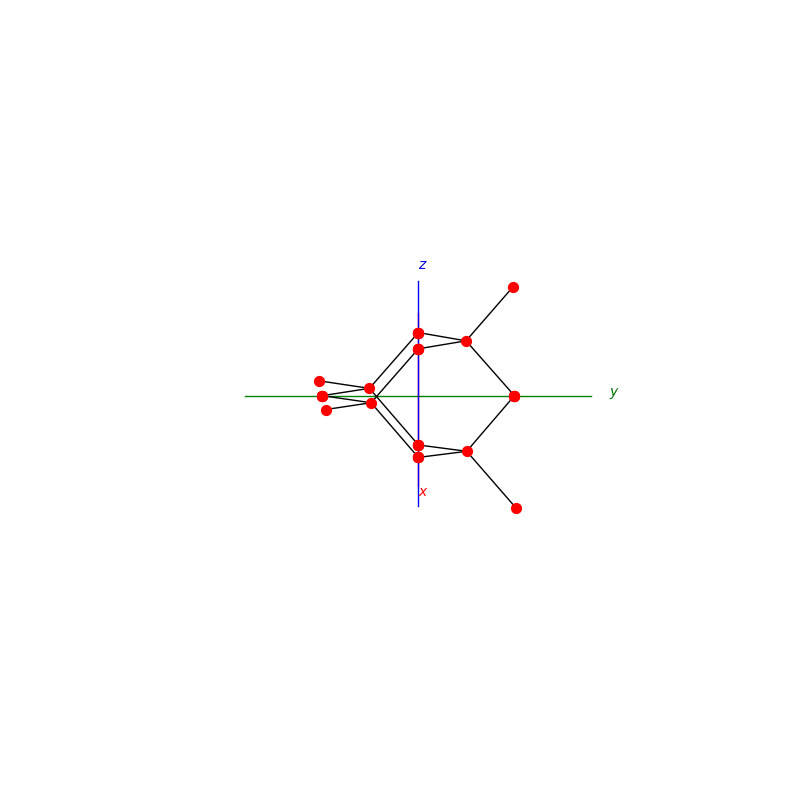

# Atomic Structures

## Lattices

```py
prim = primitive_cell_2d('square')
make_lattice(prim)
plt.show()
```

```py
prim = primitive_cell_2d('rhombus')
make_lattice(prim)
plt.show()
```

<p float="left">
  
  
</p>

### unit cells

```py
def BCC(ax):
```
```py
def FCC(ax):
```
<p float="left">
  
  
</p>

```py
def NaCl(ax):
```
```py
def Diamond(ax):
```
<p float="left">
  
  
</p>

# Packings

## subdivision

```py
triangle_subdivision(n,'diag')
```

```py
triangle_subdivision(n,'grid')
```

<p float="left">
  
  
</p>

```py
triangle_subdivision(n,'zelda')
```

<p float="left">
  
</p>

## Penrose Tiling

```py
Penrose_Tiling(n,'sun')
```

```py
Penrose_Tiling(n,'star')
```

<p float="left">
  
  
</p>

