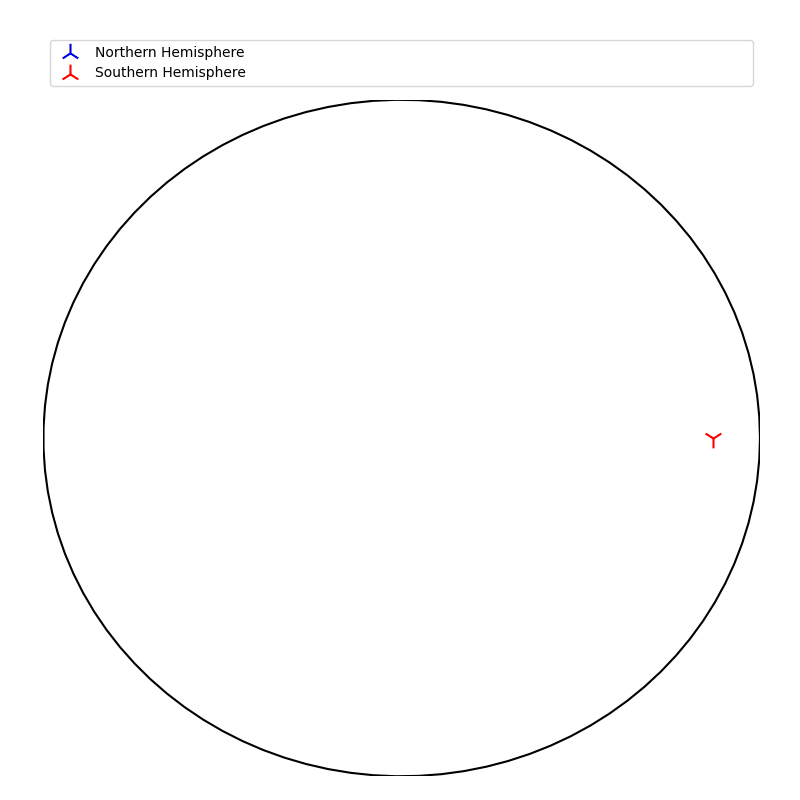
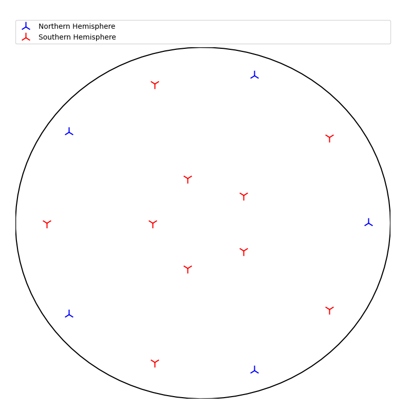

# Identifying object symmetries

## n-fold roational symmetry

```py
fig = plt.figure(0,figsize=[8,8])
ax = fig.add_subplot(111,projection='3d')
faces=shape(ax,shapearguments)
points=normal_points(ax,faces,5)
northern_points,southern_points=Stereographic_projection(points,3,'test')
identify_fold_symmetry(northern_points,southern_points)
```

<p float="left">
  
  
</p>

```bash
NFOLD =  5
```