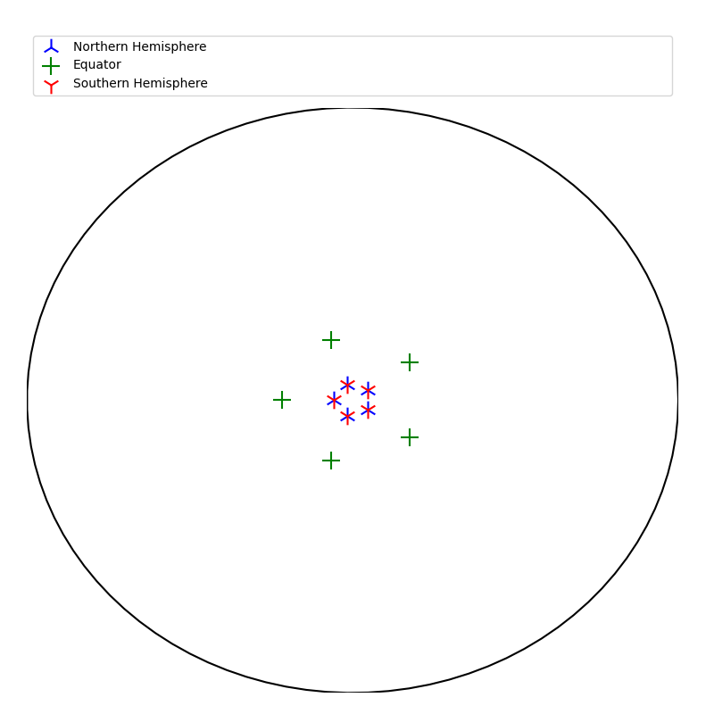

# Identifying object symmetries

There are 32 point group classifications for symmetries in crystallography. They are classified by:
 - mirror planes
 - rotational axes (nfold)
 - rotoinversion axes

## n-fold roational symmetry
```py
import matplotlib.pyplot as plt
from mpl_toolkits.mplot3d import Axes3D
from PyCrystallography.geometry import *
from PyCrystallography.stereographic_projection import *
```
```py
fig = plt.figure(0,figsize=[8,8])
ax = fig.add_subplot(111,projection='3d')
######################################
# which ever 3d model you want to load
faces=cuboid(ax,5,5,5)
######################################
points=normal_points(ax,faces,5)
northern_points,southern_points=Stereographic_projection(points,3,'test')
identify_fold_symmetry(northern_points,southern_points)
```

<p float="left">
  
  
</p>

```bash
NFOLD =  5
```
