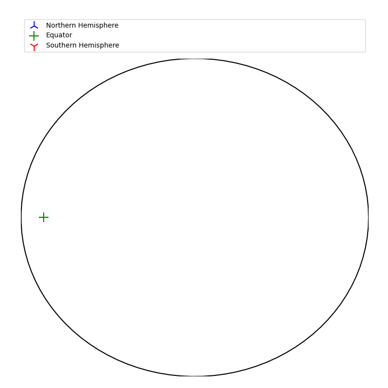

# Operations

In crystallography an object is considered symmetrical if it exhibits the 3 opertions of symmetry.

```py
import matplotlib.pyplot as plt
from mpl_toolkits.mplot3d import Axes3D
from PyCrystallography.operation import *
```
```py
fig = plt.figure()
ax = fig.add_subplot(111,projection='3d')
######################################
# which ever 3d model you want to load
inversion(ax)
######################################
plt.show()
```

<hr />

## (i) Inversion <a name="i"></a>
```py
def inversion(ax,h,w,d):
```

<p float="left">
  
</p>

<p float="left">
  
</p>

<hr />

## (ii) Reflection <a name="ii"></a>

```py
def reflection(ax,h,w,d):
```

<p float="left">
  
</p>

<hr />

## (iii) Rotation <a name="iii"></a>
requires `PyCrystallography.stereographic_projection`
<p float="left">
  
</p>
