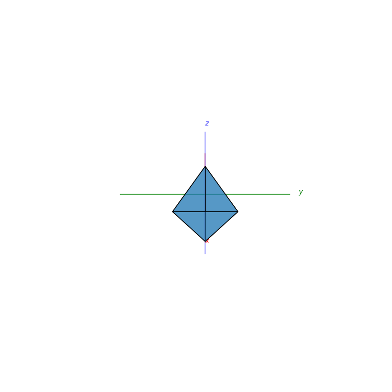
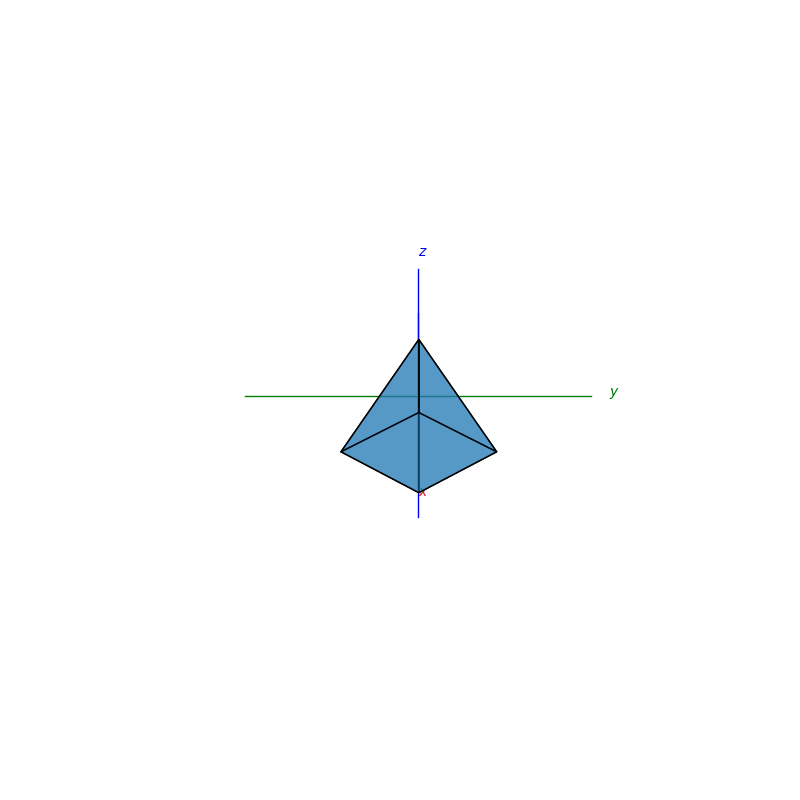
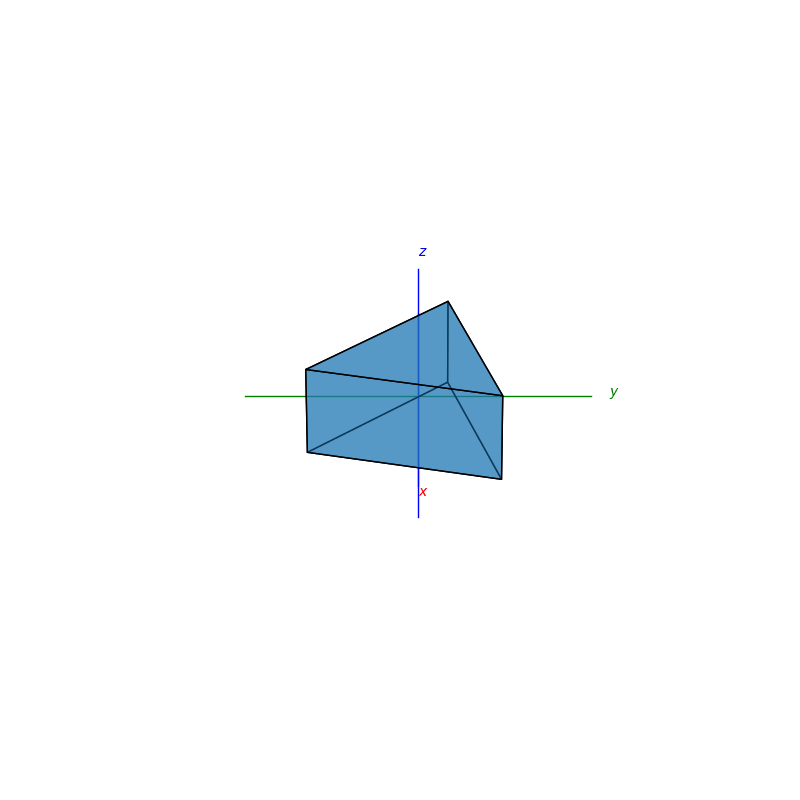
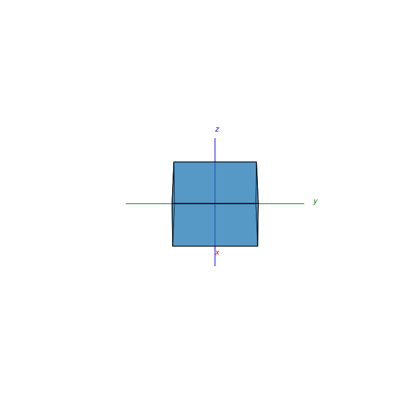
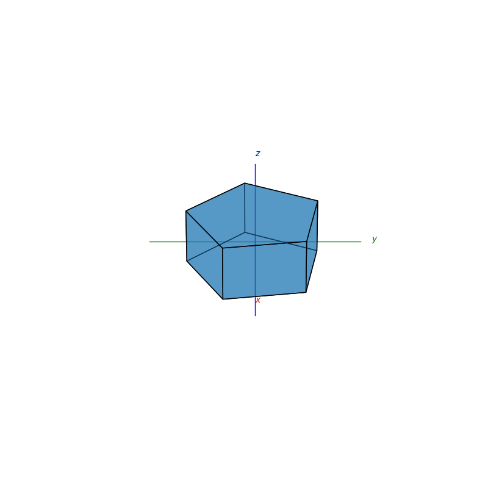
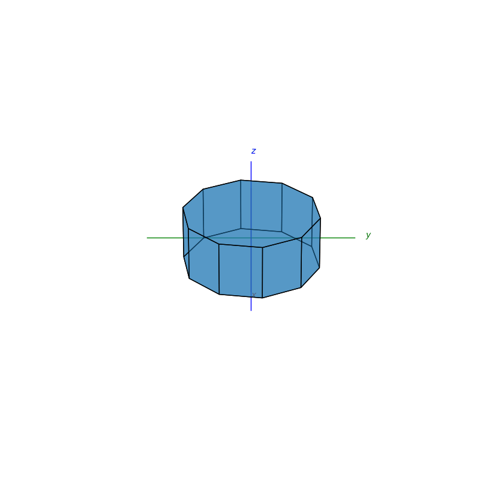
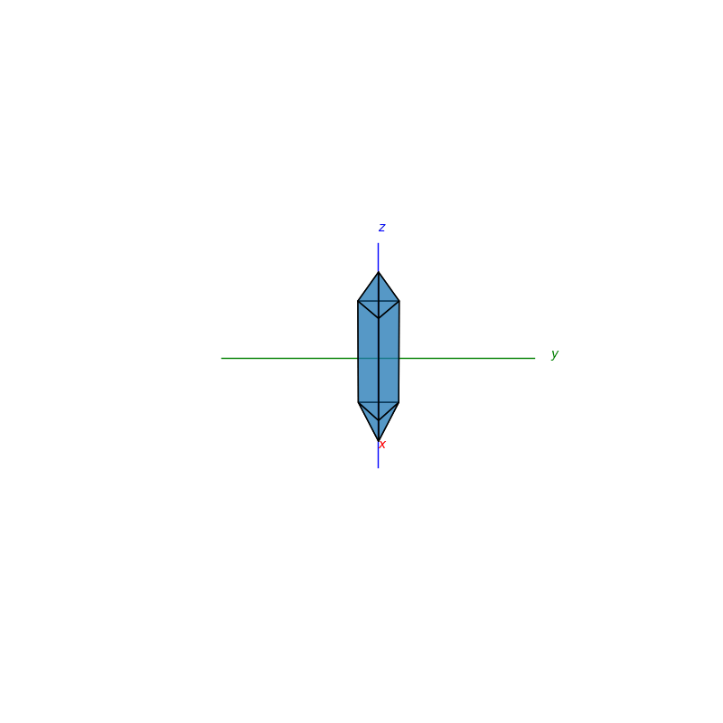
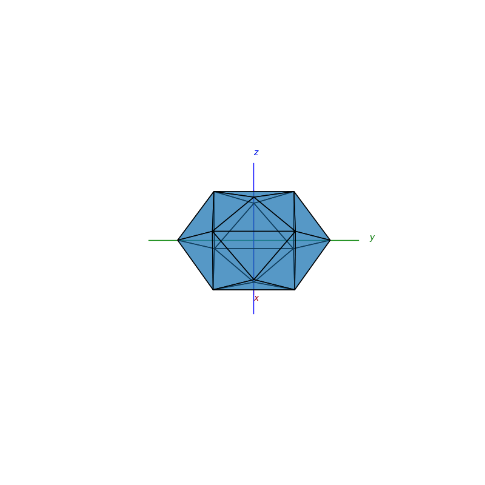

## Shapes
```py
import matplotlib.pyplot as plt
from mpl_toolkits.mplot3d import Axes3D
from PyShapes import *
```
```py
fig = plt.figure()
ax = fig.add_subplot(111,projection='3d')
plot_axis(ax)
cuboid(ax,5,5,5)

plt.show()
```
### Cuboids
```py
def cuboid(ax,h,w,d):
```
<p float="left">
  
  
  
  
</p>

### Pyramids
```py
def pryamid(ax,h,num_of_side):
```
<p float="left">
  
  
  
  
</p>

### Bipyramids
```py
def bipryamid(ax,h,num_of_side):
```
<p float="left">
  
  
  
  
</p>

### Prisms
```py
def prism(ax,h,num_of_side):
```
<p float="left">
  
  
  
  
</p>

### Biprismid (not sure what its proper name is)
```py
def biprismid(ax,h,num_of_side):
```
<p float="left">
  
  
  
  
</p>

### Tetrakis
```py
def tetrakis(ax,h,dh):
```
<p float="left">
  
</p>