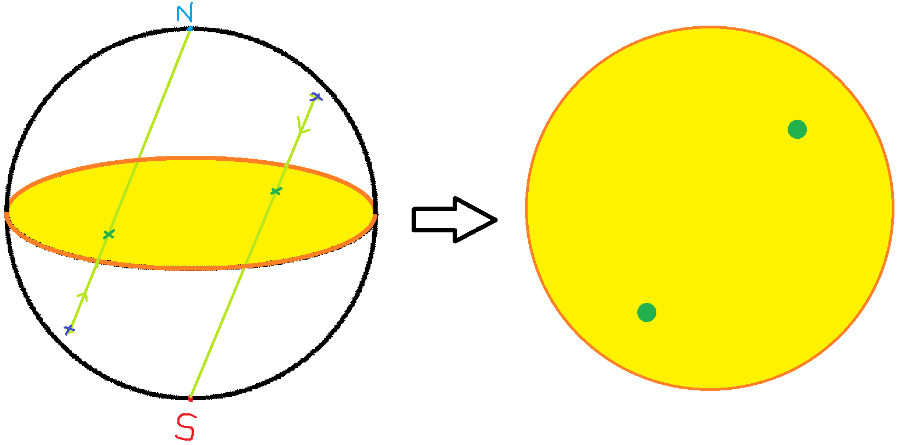
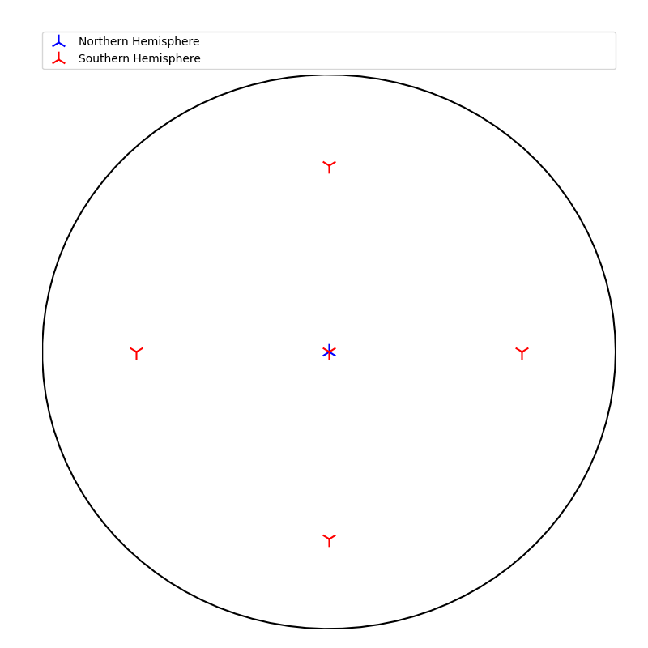

## Face normal detection and Stereographic Projection
The projections in this package work by projecting points that lie on a sphere on a 2d disc about the equator. Points in the northern hemisphere will be mapped towards the south pole and points in the southern hemisphere will be mapped towards the northpole.

<p float="middle">
  
</p>

```py

fig = plt.figure(0,figsize=[8,8])
ax = fig.add_subplot(111,projection='3d')
h,w,d = 2,2,2
faces = cuboid(ax,h,w,d)
r = max(h,w,d)
points=normal_points(ax,faces,r)
Stereographic_projection(ax,points,r)
plt.show()
```
<p float="left">
  
  
</p>

```py
fig = plt.figure(0,figsize=[8,8])
ax = fig.add_subplot(111,projection='3d')
faces = pyramid(ax,1,0.5,3)
points=normal_points(ax,faces,1)
Stereographic_projection(ax,points,1,'stereographic_projection_pyramid')
plt.show()
```
<p float="left">
  
  
</p>

```py
fig = plt.figure(0,figsize=[8,8])
ax = fig.add_subplot(111,projection='3d')
faces = bipyramid(ax,1,0.5,6)
points=normal_points(ax,faces,1)
Stereographic_projection(ax,points,2,'stereographic_projection_bipyramid')
plt.show()
```

<p float="left">
  
  
</p>

```py
fig = plt.figure(0,figsize=[8,8])
ax = fig.add_subplot(111,projection='3d')
faces = prism(ax,2,2,6)
points=normal_points(ax,faces,2)
Stereographic_projection(ax,points,2,'stereographic_projection_prism')
plt.show()
```

<p float="left">
  
  
</p>

```py
fig = plt.figure(0,figsize=[8,8])
ax = fig.add_subplot(111,projection='3d')
faces = biprismid(ax,3,1,0.5,5)
points=normal_points(ax,faces,3)
Stereographic_projection(ax,points,3,'stereographic_projection_prism')
plt.show()
```

<p float="left">
  
  
</p>

```py
fig = plt.figure(0,figsize=[8,8])
ax = fig.add_subplot(111,projection='3d')
faces = tetrakis(ax,4,1)
points=normal_points(ax,faces,5)
Stereographic_projection(ax,points,5,'stereographic_projection_tetrakis')
plt.show()
```

<p float="left">
  
  
</p>