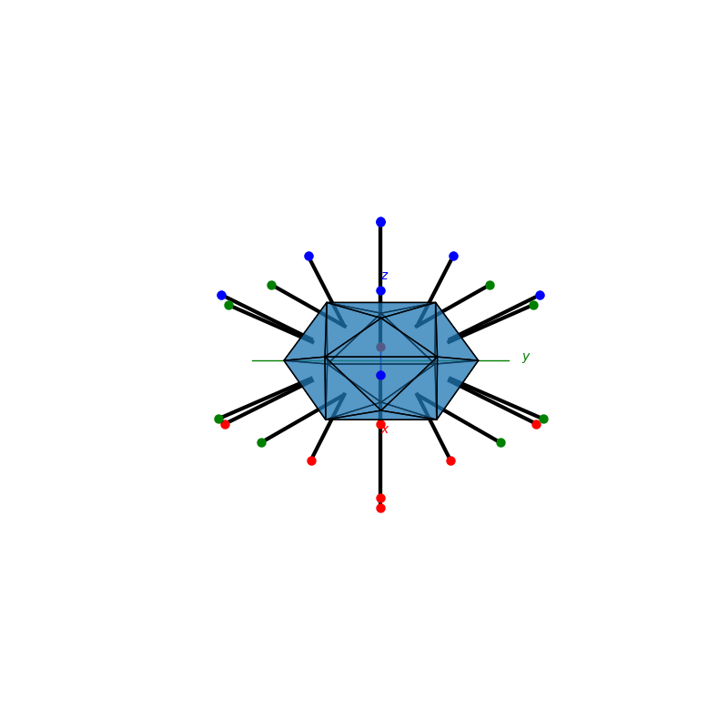
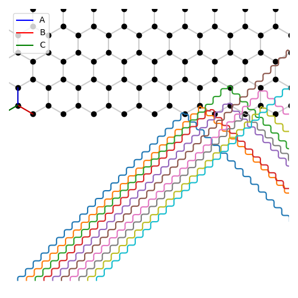

# Welcome
PyCrystallography is a Python 3 package for illustrating and simulating crystallography exercises. Using interactive 2D and 3D models to activily help you visualise concepts.

<br>

Note - this site is best viewed on a Desktop

<br>

<hr />

<br>

## Installation
pip installable - to see release versions see [PyPi - PyCrystallography](https://pypi.org/project/PyCrystallography/):
```bash
pip3 install PyCrystallography
```

or
Clone the source repository:
```bash
git clone https://github.com/Shellywell123/PyCrystallography/
```

<br>

<hr />

<br>

## Some Examples
### [Penrose Tiling](docs/atomic_structure.md)

<p float="middle" style="margin: auto;">
  <a href="docs/atomic_structure.html">
    
  </a>
  <a href="docs/atomic_structure.html">
   
  </a>  
</p>


### [Atomic Structures](docs/atomic_structure.md)

<p float="middle" style="margin: auto;">
  <a href="docs/atomic_structure.html">
    
  </a>
  <a href="docs/atomic_structure.html">
   
  </a>  
</p>


### [Operations](docs/operations.md)

<p float="middle" style="margin: auto;">
  <a href="docs/operations.html">
    
  </a>
  <a href="docs/operations.html">
   
  </a>  
</p>

### [Miller Indices](docs/atomic_structure.md)

<p float="middle" style="margin: auto;">
  <a href="docs/atomic_structure.html">
    
  </a>
  <a href="docs/atomic_structure.html">
   
  </a>  
</p>


### [Geometry](docs/geometry.md)

<p float="middle" style="margin: auto;">
  <a href="docs/geometry.html">
    
  </a>
  <a href="docs/geometry.html">
   
  </a>  
</p>

### [Stereographic Projections](docs/stereographic_projections.md)

<p float="middle" style="margin: auto;">
  <a href="docs/stereographic_projections.html">
    
  </a>
  <a href="docs/stereographic_projections.html">
   
  </a>  
</p>

### [Moire Patterns](docs/moire_patterns.md)

<p float="middle" style="margin: auto;">
  <a href="docs/moire_patterns.html">
    
  </a>
  <a href="docs/moire_patterns.html">
   
  </a>  
</p>

### [X-ray Diffraction](docs/xray_diffraction.md)

<p float="middle" style="margin: auto;">
  <a href="docs/xray_diffraction.html">
    
  </a>
  <a href="docs/xray_diffraction.html">
   
  </a>  
</p>
