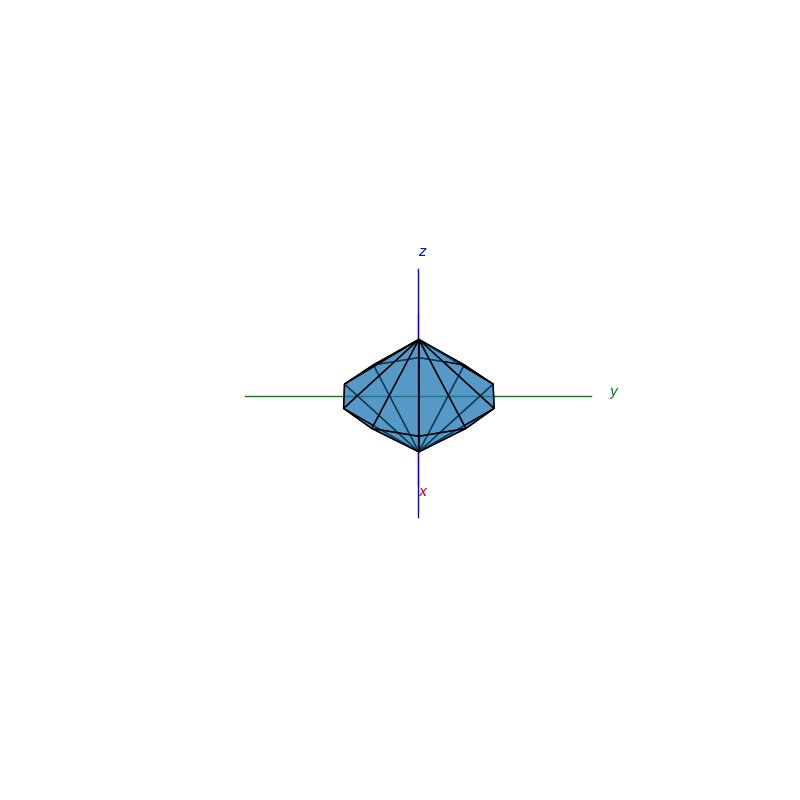

# Welcome
PyCrystallography is a Python 3 package for illustrating and simulating crystallography exercises. Using interactive 2D and 3D models to activily help you visualise concepts.

<hr />

## Installation
pip installable - to see release versions see [PyPi - PyCrystallography](https://pypi.org/project/PyCrystallography/):
```bash
pip3 install PyCrystallography
```

or
Clone the source repository:
```bash
git clone https://github.com/Shellywell123/PyCrystallography/
```


## Some Examples
### [Penrose Tiling](docs/atomic_structure.md)

<p float="left">
  
  
</p>


### [Atomic Structures](docs/atomic_structure.md)

<p float="left">
  
  
</p>


### [Operations](docs/operations.md)

<p float="left">
  
  
</p>


### [Miller Indices](docs/atomic_structure.md)

<p float="left">
  
  
</p>

### [Geometry](https://github.com/Shellywell123/PyCrystallography/blob/main/docs/geometry.md)

<p float="left">
  
  
</p>

### [Face normal detection and Stereographic Projections](docs/stereographic_projections.md)

<p float="left">
  
  
</p>

### [Moire Patterns](docs/moire_patterns.md)

<p float="middle">
  
  
</p>

### [Xray-Diffraction](docs/xray_diffraction.md)
<p float="middle">
  
  
</p>

